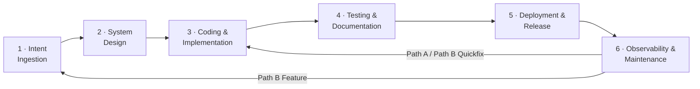

# Agentic Software Development Life Cycle (A-SDLC)

> A framework that defines how software is built, tested, and released when AI agents work alongside human developers.

---

## What Is the A-SDLC?

The Agentic SDLC is a paradigm shift where AI agents evolve from passive coding assistants to autonomous owners of specific lifecycle phases. It moves the human role from **granular execution** to **high-level orchestration**, decoupling output from headcount and eliminating the "wait states" inherent in manual hand-offs.

The framework:

- **Replaces the traditional SDLC** — backwards- and forwards-compatible
- **Is solution, model, and toolchain agnostic** — works with any agent or stack
- **Is usable by both humans and agents** at every step and task

### Key Value Propositions

| Benefit | Target | Mechanism |
| ------- | ------ | --------- |
| **Velocity** | 20–30% faster delivery | Agents handle "in-between" work: environment setup, triage, PR descriptions |
| **Quality** | 70% fewer production defects | Deep-context testing; programmatically enforced standards during coding |
| **Governance** | Non-negotiable compliance | Immutable Core Security Directives injected into every agent context |
| **Role Evolution** | Developer → System Orchestrator | Agents own repetitive tasks; engineers focus on architectural innovation |

---

## The Six Stages



| Stage | Name | Purpose |
| ----- | ---- | ------- |
| [Stage 1](stages/01-intent-ingestion/README.md) | Intent Ingestion | Capture, disambiguate, and structure incoming change requests |
| [Stage 2](stages/02-system-design/README.md) | System Design | Translate intent into architecture; inject security directives |
| [Stage 3](stages/03-coding-implementation/README.md) | Coding & Implementation | Produce, review, and verify code; most control-dense stage |
| [Stage 4](stages/04-testing-documentation/README.md) | Testing & Documentation | Verify correctness, safety, and completeness before release |
| [Stage 5](stages/05-deployment-release/README.md) | Deployment & Release | Promote to production with maximum governance controls |
| [Stage 6](stages/06-observability-maintenance/README.md) | Observability & Maintenance | Continuous monitoring; the only stage that never ends |

---

## Control Framework

Five control tracks run through the entire lifecycle:

| Track | Code | Focus |
| ----- | ---- | ----- |
| Quality Controls | `QC` | Work meets standards |
| Risk Controls | `RC` | Identify and manage what can go wrong |
| Security Controls | `SC` | Protect against threats and vulnerabilities |
| AI Controls | `AC` | EU AI Act requirements |
| Governance Controls | `GC` | Audit trail across everything |

### All Controls at a Glance

| Stage | QC | RC | SC | AC | GC |
| ----- | -- | -- | -- | -- | -- |
| Cross-cutting | — | — | — | — | GC-0A, GC-0B, GC-0C |
| 1 Intent Ingestion | QC-1A, QC-1B | RC-1A | SC-1A | AC-1A | GC-1A |
| 2 System Design | QC-2A | RC-2A | SC-2A, SC-2B | AC-2A | — |
| 3 Coding & Impl | QC-3A, QC-3B | RC-3A | SC-3A, SC-3B, SC-3C | — | GC-3A |
| 4 Testing & Docs | QC-4A, QC-4B, QC-4C | RC-4A | SC-4A, SC-4B | AC-4A | — |
| 5 Deployment | QC-5A | RC-5A, RC-5B | SC-5A, SC-5B | — | — |
| 6 Observability | QC-6A | RC-6A | SC-6A, SC-6B | AC-6A | — |

**Total: 38 controls** (including 3 cross-cutting). Full definitions in [controls/registry.yaml](controls/registry.yaml).

---

## Regulatory Compliance

Every control is mapped to at least one of three regulatory frameworks:

- **DORA** — Digital Operational Resilience Act (EU, from January 2025): ICT risk management, incident reporting, operational resilience, third-party oversight
- **DNB** — De Nederlandsche Bank: Dutch supervisory expectations for IT governance, change management, and operational risk
- **EU AI Act** — Risk-tiered AI requirements: transparency, data governance, accuracy, robustness, human oversight

See [regulatory/compliance-matrix.yaml](regulatory/compliance-matrix.yaml) for the full mapping.

---

## Repository Structure

```text
a-sdlc/
├── AGENTS.md                          ← Agent entrypoint (read first if you are an agent)
├── README.md                          ← This file
├── framework.yaml                     ← Machine-readable manifest of all stages and controls
├── schema/
│   ├── control.schema.json            ← JSON Schema for control definitions
│   └── feature-spec.schema.json      ← JSON Schema for feature specifications
├── controls/
│   ├── registry.yaml                 ← Flat index of all 38 controls (fast lookup by ID)
│   ├── qc/                           ← Quality Control definitions (QC-1A … QC-6A)
│   ├── rc/                           ← Risk Control definitions (RC-1A … RC-6A)
│   ├── sc/                           ← Security Control definitions (SC-1A … SC-6B)
│   ├── ac/                           ← AI Control definitions (AC-1A, AC-2A, AC-4A, AC-6A)
│   └── gc/                           ← Governance Control definitions (GC-0A … GC-3A)
├── stages/
│   ├── 01-intent-ingestion/          ← stage.yaml + README.md + templates/
│   ├── 02-system-design/             ← stage.yaml + README.md + directives/
│   ├── 03-coding-implementation/     ← stage.yaml + README.md
│   ├── 04-testing-documentation/     ← stage.yaml + README.md
│   ├── 05-deployment-release/        ← stage.yaml + README.md
│   └── 06-observability-maintenance/ ← stage.yaml + README.md
├── feedbackloops/
│   ├── README.md                     ← Feedback process documentation and decision tree
│   └── feedback-loops.yaml          ← Path A and Path B re-entry definitions
└── regulatory/
    ├── compliance-matrix.yaml        ← DORA / DNB / EU AI Act coverage map
    └── sources.yaml                  ← Official article texts and obligation summaries
```

---

## If You Are an Agent

Start with [AGENTS.md](AGENTS.md). It contains your mandatory operating instructions, navigation map, delegation pattern definitions, and behavioural rules.
