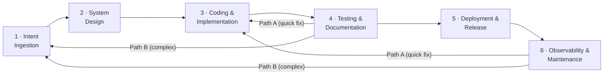

# Agentic Software Development Life Cycle (A-SDLC)

> A framework that defines how software is built, tested, and released when AI agents work alongside human developers.

---

## What Is the A-SDLC?

The Agentic SDLC is a paradigm shift where AI agents evolve from passive coding assistants to autonomous owners of specific lifecycle phases. It moves the human role from granular execution to high-level orchestration, decoupling output from headcount and eliminating the "wait states" inherent in manual hand-offs.

The framework:

- **Replaces the traditional SDLC — backwards- and forwards-compatible**
- **Is solution, model, and toolchain agnostic — works with any agent or stack**
- **Is usable by both humans and agents at every step and task**

### Key Value Propositions

| Benefit | Target | Mechanism |
| ------- | ------ | --------- |
| **Velocity** | 20–30% faster delivery | Agents handle "in-between" work — environment setup, triage, PR descriptions |
| **Quality** | 70% fewer production defects | Deep-context testing; programmatically enforced standards during coding |
| **Governance** | Non-negotiable compliance | Immutable Core Security Directives injected into every agent context |
| **Role Evolution** | Developer → System Orchestrator | Agents own repetitive tasks; engineers focus on architectural innovation |

---

## The Six Stages



| Stage | Name | Purpose |
| ----- | ---- | ------- |
| [Stage 1](stages/01-intent-ingestion/README.md) | Intent Ingestion | High-level business goals are captured, disambiguated, and transformed into structured technical requirements. Establishes the source of truth for all subsequent agentic actions. |
| [Stage 2](stages/02-system-design/README.md) | System Design | Validated intent is translated into architecture and technical specifications. Threat modelling and stage directive injection occur here before any coding begins. |
| [Stage 3](stages/03-coding-implementation/README.md) | Coding & Implementation | Code is produced by human developers, AI agents, or both. The most control-dense stage: enforces quality, controls agent permissions, scans for security issues, tracks provenance, and converges into a reviewed PR. |
| [Stage 4](stages/04-testing-documentation/README.md) | Testing & Documentation | The verification gate. Answers "does it work correctly?" and "is it safe to release?" Culminates in a risk threshold evaluation that opens or blocks the door to deployment. |
| [Stage 5](stages/05-deployment-release/README.md) | Deployment & Release | Promotion to production. Carries the strongest governance requirements. Ensures everything prior is complete, the deployment is trustworthy, and there is a verified rollback path. |
| [Stage 6](stages/06-observability-maintenance/README.md) | Observability & Maintenance | The only stage that never ends. Continuous monitoring of operational health, security posture, risk evolution, and AI behaviour. Feeds back into the lifecycle through defined re-entry paths. |

When Stage 4 or Stage 6 detects an issue requiring a code change, work re-enters via the [Feedback Loops](feedbackloops/README.md): **Path A** (easy/obvious/low-risk → Stage 3) or **Path B** (otherwise → Stage 1).

---

## Control Framework

Five control tracks run through the entire lifecycle:

| Track | Code | Focus |
| ----- | ---- | ----- |
| [Quality Controls](controls/qc/) | `QC` | Ensure work meets standards |
| [Risk Controls](controls/rc/) | `RC` | Identify and manage what can go wrong |
| [Security Controls](controls/sc/) | `SC` | Protect against threats and vulnerabilities |
| [AI Controls](controls/ac/) | `AC` | Address EU AI Act requirements |
| [Governance Controls](controls/gc/) | `GC` | Maintain the audit trail across everything |

### All Controls at a Glance

| Stage | QC | RC | SC | AC | GC |
| ----- | -- | -- | -- | -- | -- |
| Cross-cutting | — | — | [SC-0D](controls/sc/SC-0D.yaml), [SC-2B](controls/sc/SC-2B.yaml) | — | [GC-0A](controls/gc/GC-0A.yaml), [GC-0B](controls/gc/GC-0B.yaml), [GC-0C](controls/gc/GC-0C.yaml), [GC-0D](controls/gc/GC-0D.yaml) |
| [1 Intent Ingestion](stages/01-intent-ingestion/README.md) | [QC-1A](controls/qc/QC-1A.yaml), [QC-1B](controls/qc/QC-1B.yaml) | [RC-1A](controls/rc/RC-1A.yaml) | [SC-1A](controls/sc/SC-1A.yaml), [SC-1B](controls/sc/SC-1B.yaml) | [AC-1A](controls/ac/AC-1A.yaml), [AC-1B](controls/ac/AC-1B.yaml) | [GC-1A](controls/gc/GC-1A.yaml) |
| [2 System Design](stages/02-system-design/README.md) | [QC-2A](controls/qc/QC-2A.yaml) | [RC-2A](controls/rc/RC-2A.yaml), [RC-2B](controls/rc/RC-2B.yaml) | [SC-2A](controls/sc/SC-2A.yaml), [SC-2C](controls/sc/SC-2C.yaml) | [AC-2A](controls/ac/AC-2A.yaml), [AC-2B](controls/ac/AC-2B.yaml) | — |
| [3 Coding & Implementation](stages/03-coding-implementation/README.md) | [QC-3A](controls/qc/QC-3A.yaml), [QC-3B](controls/qc/QC-3B.yaml) | [RC-3A](controls/rc/RC-3A.yaml) | [SC-3A](controls/sc/SC-3A.yaml), [SC-3B](controls/sc/SC-3B.yaml), [SC-3C](controls/sc/SC-3C.yaml), [SC-3D](controls/sc/SC-3D.yaml), [SC-3E](controls/sc/SC-3E.yaml) | — | [GC-3A](controls/gc/GC-3A.yaml) |
| [4 Testing & Documentation](stages/04-testing-documentation/README.md) | [QC-4A](controls/qc/QC-4A.yaml), [QC-4B](controls/qc/QC-4B.yaml), [QC-4C](controls/qc/QC-4C.yaml) | [RC-4A](controls/rc/RC-4A.yaml) | [SC-4A](controls/sc/SC-4A.yaml), [SC-4B](controls/sc/SC-4B.yaml), [SC-4C](controls/sc/SC-4C.yaml), [SC-4D](controls/sc/SC-4D.yaml) | [AC-4A](controls/ac/AC-4A.yaml) | — |
| [5 Deployment & Release](stages/05-deployment-release/README.md) | [QC-5A](controls/qc/QC-5A.yaml) | [RC-5A](controls/rc/RC-5A.yaml), [RC-5B](controls/rc/RC-5B.yaml) | [SC-5A](controls/sc/SC-5A.yaml), [SC-5B](controls/sc/SC-5B.yaml), [SC-5C](controls/sc/SC-5C.yaml) | — | — |
| [6 Observability & Maintenance](stages/06-observability-maintenance/README.md) | [QC-6A](controls/qc/QC-6A.yaml) | [RC-6A](controls/rc/RC-6A.yaml), [RC-6B](controls/rc/RC-6B.yaml) | [SC-6A](controls/sc/SC-6A.yaml), [SC-6B](controls/sc/SC-6B.yaml) | [AC-6A](controls/ac/AC-6A.yaml) | — |

**Total: 51 controls** across 5 tracks (QC: 10, RC: 9, SC: 20, AC: 6, GC: 6), including cross-cutting controls. Full index in [controls/registry.yaml](controls/registry.yaml).

---

## Repository Structure

```text
a-sdlc/
├── AGENTS.md                          ← Agent entrypoint (read first if you are an agent)
├── README.md                          ← This file
├── asdlc.yaml                         ← Machine-readable manifest of all stages and controls
├── schema/
│   ├── control.schema.json            ← JSON Schema for control definitions
│   └── feature-spec.schema.json       ← JSON Schema for feature specifications
├── controls/
│   ├── registry.yaml                  ← Flat index of all 51 controls (fast lookup by ID)
│   ├── README.md                      ← Controls directory documentation
│   ├── qc/                            ← Quality Control definitions (10 controls)
│   ├── rc/                            ← Risk Control definitions (8 controls)
│   ├── sc/                            ← Security Control definitions (16 controls)
│   ├── ac/                            ← AI Control definitions (6 controls)
│   └── gc/                            ← Governance Control definitions (6 controls)
├── directives/
│   ├── core/
│   │   └── core-directives.yaml       ← Immutable core security directives (SC-0D payload)
│   └── stages/                        ← Stage-specific directive payloads (SC-2B injection)
├── stages/
│   ├── 01-intent-ingestion/           ← Intent Ingestion stage (6 controls)
│   ├── 02-system-design/              ← System Design stage (5 controls)
│   ├── 03-coding-implementation/      ← Coding & Implementation stage (7 controls)
│   ├── 04-testing-documentation/      ← Testing & Documentation stage (7 controls)
│   ├── 05-deployment-release/         ← Deployment & Release stage (5 controls)
│   └── 06-observability-maintenance/  ← Observability & Maintenance stage (5 controls)
├── feedbackloops/
│   ├── README.md                      ← Feedback process documentation
│   ├── feedback-loops.yaml            ← Path A (quick fix) and Path B (full re-entry) definitions
│   └── artifacts/                     ← Feedback loop templates and outputs
├── regulatory/
│   ├── sources.yaml                   ← Regulatory source documents and frameworks
│   ├── compliance-matrix.yaml         ← Complete control-to-article mappings
│   └── README.md                      ← Regulatory coverage summary and strength areas
├── scripts/                           ← Utility scripts (validation, analysis, etc.)
└── initialcontext/                    ← Original regulatory source documents (MIME-encoded HTML)
```

---

## Regulatory Compliance

The A-SDLC framework is engineered for compliance with **DORA** (Digital Operational Resilience Act) and the **EU AI Act**. **All 51 controls have explicit regulatory mappings** to specific articles and requirements.

### Coverage Summary

| Framework | Controls Mapped | Coverage |
| --------- | --------------- | -------- |
| **DORA** | 43 / 51 | **84.3%** |
| **EU AI Act** | 30 / 51 | **58.8%** |

### Regulatory Strengths by Track

- **RC (Risk Controls):** 100% DORA mapped — Risk identification, design approval, change management, CAB gates
- **SC (Security Controls):** 100% DORA mapped — Comprehensive testing (SAST/DAST/API/adversarial), supply chain, incident management
- **GC (Governance Controls):** 100% DORA & EU AI Act — Audit trails, traceability, compliance automation
- **AC (AI Controls):** 100% EU AI Act — Risk classification, bias testing, model governance, post-market surveillance
- **QC (Quality Controls):** 80% DORA, 50% EU AI Act — Documentation, testing, specification validation

### Key Regulatory Areas Addressed

| Area | DORA Articles | EU AI Act Articles | Key Controls |
| ---- | ------------- | ------------------ | ------------ |
| **Risk Management** | Art. 8–9 | Art. 6, 9, Annex III | RC-1A, AC-1A, RC-2A, RC-4A |
| **Security Testing** | Art. 24–25 | Art. 15 | SC-4A, SC-4B, SC-4C, SC-4D, QC-4A |
| **Supply Chain** | Art. 28 | Art. 10, 17 | SC-3D, SC-3E, GC-0C, GC-3A |
| **Change Management** | Art. 9(4) | Art. 9 | RC-2A, RC-5A, QC-3A, QC-3B |
| **Documentation** | Art. 8(5-6) | Art. 11, Annex IV | QC-4C, AC-2A, AC-2B |
| **Record-Keeping** | Art. 8(6) | Art. 12 | GC-0A, GC-0B, RC-3A, GC-0D |
| **Incident Management** | Art. 17–19 | Art. 73 | SC-6A, SC-6B, GC-0A |
| **GPAI Models** | — | Art. 51–56 | AC-1B, AC-2A, AC-2B |

For detailed mappings of all 51 controls to regulatory articles, see: **[regulatory/compliance-matrix.yaml](regulatory/compliance-matrix.yaml)** and **[regulatory/README.md](regulatory/README.md)**

---

## If You Are an Agent

Start with [AGENTS.md](AGENTS.md). It contains your mandatory operating instructions, navigation map, delegation pattern definitions, and behavioural rules.

**Last Updated:** 2026-03-05 20:53 UTC