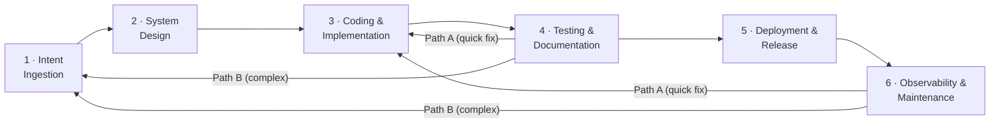

# Agentic Software Development Life Cycle (A-SDLC)

> A framework that defines how software is built, tested, and released when AI agents work alongside human developers.

---

## What Is the A-SDLC?

The Agentic SDLC is a paradigm shift where AI agents evolve from passive coding assistants to autonomous owners of specific lifecycle phases. It moves the human role from **granular execution** to **high-level orchestration**, decoupling output from headcount and eliminating the "wait states" inherent in manual hand-offs.

The framework:

- **Replaces the traditional SDLC** — backwards- and forwards-compatible
- **Is solution, model, and toolchain agnostic** — works with any agent or stack
- **Is usable by both humans and agents** at every step and task

### Key Value Propositions

| Benefit | Target | Mechanism |
| ------- | ------ | --------- |
| **Velocity** | 20–30% faster delivery | Agents handle "in-between" work: environment setup, triage, PR descriptions |
| **Quality** | 70% fewer production defects | Deep-context testing; programmatically enforced standards during coding |
| **Governance** | Non-negotiable compliance | Immutable Core Security Directives injected into every agent context |
| **Role Evolution** | Developer → System Orchestrator | Agents own repetitive tasks; engineers focus on architectural innovation |

---

## The Six Stages



| Stage | Name | Purpose |
| ----- | ---- | ------- |
| [Stage 1](stages/01-intent-ingestion/README.md) | Intent Ingestion | Capture, disambiguate, and structure incoming change requests |
| [Stage 2](stages/02-system-design/README.md) | System Design | Translate intent into architecture; inject security directives |
| [Stage 3](stages/03-coding-implementation/README.md) | Coding & Implementation | Produce, review, and verify code; most control-dense stage |
| [Stage 4](stages/04-testing-documentation/README.md) | Testing & Documentation | Verify correctness, safety, and completeness before release |
| [Stage 5](stages/05-deployment-release/README.md) | Deployment & Release | Promote to production with maximum governance controls |
| [Stage 6](stages/06-observability-maintenance/README.md) | Observability & Maintenance | Continuous monitoring; the only stage that never ends |

When Stage 4 or Stage 6 detects an issue requiring a code change, work re-enters via the [Feedback Loops](feedbackloops/README.md): **Path A** (easy/obvious/low-risk → Stage 3) or **Path B** (otherwise → Stage 1).

---

## Control Framework

Five control tracks run through the entire lifecycle:

| Track | Code | Focus |
| ----- | ---- | ----- |
| [Quality Controls](controls/qc/) | `QC` | Work meets standards |
| [Risk Controls](controls/rc/) | `RC` | Identify and manage what can go wrong |
| [Security Controls](controls/sc/) | `SC` | Protect against threats and vulnerabilities |
| [AI Controls](controls/ac/) | `AC` | EU AI Act requirements |
| [Governance Controls](controls/gc/) | `GC` | Audit trail across everything |

### All Controls at a Glance

| Stage | QC | RC | SC | AC | GC |
| ----- | -- | -- | -- | -- | -- |
| Cross-cutting | — | — | [SC-0D](controls/sc/SC-0D.yaml) | — | [GC-0A](controls/gc/GC-0A.yaml), [GC-0B](controls/gc/GC-0B.yaml), [GC-0C](controls/gc/GC-0C.yaml) |
| [1 Intent Ingestion](stages/01-intent-ingestion/README.md) | [QC-1A](controls/qc/QC-1A.yaml), [QC-1B](controls/qc/QC-1B.yaml) | [RC-1A](controls/rc/RC-1A.yaml) | [SC-1A](controls/sc/SC-1A.yaml) | [AC-1A](controls/ac/AC-1A.yaml) | [GC-1A](controls/gc/GC-1A.yaml) |
| [2 System Design](stages/02-system-design/README.md) | [QC-2A](controls/qc/QC-2A.yaml) | [RC-2A](controls/rc/RC-2A.yaml) | [SC-2A](controls/sc/SC-2A.yaml), [SC-2B](controls/sc/SC-2B.yaml) | [AC-2A](controls/ac/AC-2A.yaml) | — |
| [3 Coding & Impl](stages/03-coding-implementation/README.md) | [QC-3A](controls/qc/QC-3A.yaml), [QC-3B](controls/qc/QC-3B.yaml) | [RC-3A](controls/rc/RC-3A.yaml) | [SC-3A](controls/sc/SC-3A.yaml), [SC-3B](controls/sc/SC-3B.yaml), [SC-3C](controls/sc/SC-3C.yaml) | — | [GC-3A](controls/gc/GC-3A.yaml) |
| [4 Testing & Docs](stages/04-testing-documentation/README.md) | [QC-4A](controls/qc/QC-4A.yaml), [QC-4B](controls/qc/QC-4B.yaml), [QC-4C](controls/qc/QC-4C.yaml) | [RC-4A](controls/rc/RC-4A.yaml) | [SC-4A](controls/sc/SC-4A.yaml), [SC-4B](controls/sc/SC-4B.yaml) | [AC-4A](controls/ac/AC-4A.yaml) | — |
| [5 Deployment](stages/05-deployment-release/README.md) | [QC-5A](controls/qc/QC-5A.yaml) | [RC-5A](controls/rc/RC-5A.yaml), [RC-5B](controls/rc/RC-5B.yaml) | [SC-5A](controls/sc/SC-5A.yaml), [SC-5B](controls/sc/SC-5B.yaml) | — | — |
| [6 Observability](stages/06-observability-maintenance/README.md) | [QC-6A](controls/qc/QC-6A.yaml) | [RC-6A](controls/rc/RC-6A.yaml) | [SC-6A](controls/sc/SC-6A.yaml), [SC-6B](controls/sc/SC-6B.yaml) | [AC-6A](controls/ac/AC-6A.yaml) | — |

**Total: 39 controls** (including 4 cross-cutting: SC-0D, GC-0A, GC-0B, GC-0C; SC-2B is cross-cutting but executed at Stage 2). Full index in [controls/registry.yaml](controls/registry.yaml).

---

## Repository Structure

```text
a-sdlc/
├── AGENTS.md                          ← Agent entrypoint (read first if you are an agent)
├── README.md                          ← This file
├── asdlc.yaml                         ← Machine-readable manifest of all stages and controls
├── schema/
│   ├── control.schema.json            ← JSON Schema for control definitions
│   └── feature-spec.schema.json       ← JSON Schema for feature specifications
├── controls/
│   ├── registry.yaml                  ← Flat index of all 39 controls (fast lookup by ID)
│   ├── README.md                      ← Controls directory documentation
│   ├── qc/                            ← Quality Control definitions (10 controls)
│   ├── rc/                            ← Risk Control definitions (7 controls)
│   ├── sc/                            ← Security Control definitions (13 controls)
│   ├── ac/                            ← AI Control definitions (4 controls)
│   └── gc/                            ← Governance Control definitions (5 controls)
├── directives/
│   ├── core/
│   │   └── core-directives.yaml       ← Immutable core security directives (SC-0D payload)
│   └── stages/                        ← Stage-specific directive payloads (SC-2B injection)
├── stages/
│   ├── 01-intent-ingestion/           ← Intent Ingestion stage (6 controls)
│   ├── 02-system-design/              ← System Design stage (5 controls)
│   ├── 03-coding-implementation/      ← Coding & Implementation stage (7 controls)
│   ├── 04-testing-documentation/      ← Testing & Documentation stage (7 controls)
│   ├── 05-deployment-release/         ← Deployment & Release stage (5 controls)
│   └── 06-observability-maintenance/  ← Observability & Maintenance stage (5 controls)
├── feedbackloops/
│   ├── README.md                      ← Feedback process documentation
│   ├── feedback-loops.yaml            ← Path A (quick fix) and Path B (full re-entry) definitions
│   └── artifacts/                     ← Feedback loop templates and outputs
├── regulatory/
│   └── sources.yaml                   ← Regulatory source documents and frameworks
├── scripts/                           ← Utility scripts (validation, analysis, etc.)
└── initialcontext/                    ← Original regulatory source documents (MIME-encoded HTML)
```

---

## If You Are an Agent

Start with [AGENTS.md](AGENTS.md). It contains your mandatory operating instructions, navigation map, delegation pattern definitions, and behavioural rules.
