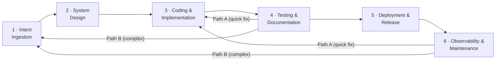

# Agentic Software Development Life Cycle (A-SDLC)

> A framework that defines how software is built, tested, and released when AI agents work alongside human developers.

---

## What Is the A-SDLC?

The Agentic SDLC is a paradigm shift where AI agents evolve from passive coding assistants to autonomous owners of specific lifecycle phases. It moves the human role from **granular execution** to **high-level orchestration**, decoupling output from headcount and eliminating the "wait states" inherent in manual hand-offs.

The framework:

- **Replaces the traditional SDLC** — backwards- and forwards-compatible
- **Is solution, model, and toolchain agnostic** — works with any agent or stack
- **Is usable by both humans and agents** at every step and task

### Key Value Propositions

| Benefit | Target | Mechanism |
| ------- | ------ | --------- |
| **Velocity** | 20–30% faster delivery | Agents handle "in-between" work: environment setup, triage, PR descriptions |
| **Quality** | 70% fewer production defects | Deep-context testing; programmatically enforced standards during coding |
| **Governance** | Non-negotiable compliance | Immutable Core Security Directives injected into every agent context |
| **Role Evolution** | Developer → System Orchestrator | Agents own repetitive tasks; engineers focus on architectural innovation |

---

## The Six Stages



| Stage | Name | Purpose |
| ----- | ---- | ------- |
| [Stage 1](stages/01-intent-ingestion/README.md) | Intent Ingestion | Capture, disambiguate, and structure incoming change requests |
| [Stage 2](stages/02-system-design/README.md) | System Design | Translate intent into architecture; inject security directives |
| [Stage 3](stages/03-coding-implementation/README.md) | Coding & Implementation | Produce, review, and verify code; most control-dense stage |
| [Stage 4](stages/04-testing-documentation/README.md) | Testing & Documentation | Verify correctness, safety, and completeness before release |
| [Stage 5](stages/05-deployment-release/README.md) | Deployment & Release | Promote to production with maximum governance controls |
| [Stage 6](stages/06-observability-maintenance/README.md) | Observability & Maintenance | Continuous monitoring; the only stage that never ends |

When Stage 4 or Stage 6 detects an issue requiring a code change, work re-enters via the [Feedback Loops](feedbackloops/README.md): **Path A** (easy/obvious/low-risk → Stage 3) or **Path B** (otherwise → Stage 1).

---

## Control Framework

Five control tracks run through the entire lifecycle:

| Track | Code | Focus |
| ----- | ---- | ----- |
| [Quality Controls](controls/qc/) | `QC` | Work meets standards |
| [Risk Controls](controls/rc/) | `RC` | Identify and manage what can go wrong |
| [Security Controls](controls/sc/) | `SC` | Protect against threats and vulnerabilities |
| [AI Controls](controls/ac/) | `AC` | EU AI Act requirements |
| [Governance Controls](controls/gc/) | `GC` | Audit trail across everything |

### All Controls at a Glance

| Stage | QC | RC | SC | AC | GC |
| ----- | -- | -- | -- | -- | -- |
| Cross-cutting | — | — | [SC-0D](controls/sc/SC-0D.yaml) | — | [GC-0A](controls/gc/GC-0A.yaml), [GC-0B](controls/gc/GC-0B.yaml), [GC-0C](controls/gc/GC-0C.yaml) |
| [1 Intent Ingestion](stages/01-intent-ingestion/README.md) | [QC-1A](controls/qc/QC-1A.yaml), [QC-1B](controls/qc/QC-1B.yaml) | [RC-1A](controls/rc/RC-1A.yaml) | [SC-1A](controls/sc/SC-1A.yaml) | [AC-1A](controls/ac/AC-1A.yaml) | [GC-1A](controls/gc/GC-1A.yaml) |
| [2 System Design](stages/02-system-design/README.md) | [QC-2A](controls/qc/QC-2A.yaml) | [RC-2A](controls/rc/RC-2A.yaml) | [SC-2A](controls/sc/SC-2A.yaml), [SC-2B](controls/sc/SC-2B.yaml) | [AC-2A](controls/ac/AC-2A.yaml) | — |
| [3 Coding & Impl](stages/03-coding-implementation/README.md) | [QC-3A](controls/qc/QC-3A.yaml), [QC-3B](controls/qc/QC-3B.yaml) | [RC-3A](controls/rc/RC-3A.yaml) | [SC-3A](controls/sc/SC-3A.yaml), [SC-3B](controls/sc/SC-3B.yaml), [SC-3C](controls/sc/SC-3C.yaml) | — | [GC-3A](controls/gc/GC-3A.yaml) |
| [4 Testing & Docs](stages/04-testing-documentation/README.md) | [QC-4A](controls/qc/QC-4A.yaml), [QC-4B](controls/qc/QC-4B.yaml), [QC-4C](controls/qc/QC-4C.yaml) | [RC-4A](controls/rc/RC-4A.yaml) | [SC-4A](controls/sc/SC-4A.yaml), [SC-4B](controls/sc/SC-4B.yaml) | [AC-4A](controls/ac/AC-4A.yaml) | — |
| [5 Deployment](stages/05-deployment-release/README.md) | [QC-5A](controls/qc/QC-5A.yaml) | [RC-5A](controls/rc/RC-5A.yaml), [RC-5B](controls/rc/RC-5B.yaml) | [SC-5A](controls/sc/SC-5A.yaml), [SC-5B](controls/sc/SC-5B.yaml) | — | — |
| [6 Observability](stages/06-observability-maintenance/README.md) | [QC-6A](controls/qc/QC-6A.yaml) | [RC-6A](controls/rc/RC-6A.yaml) | [SC-6A](controls/sc/SC-6A.yaml), [SC-6B](controls/sc/SC-6B.yaml) | [AC-6A](controls/ac/AC-6A.yaml) | — |

**Total: 39 controls** (including 4 cross-cutting: SC-0D, GC-0A, GC-0B, GC-0C; SC-2B is cross-cutting but executed at Stage 2). Full index in [controls/registry.yaml](controls/registry.yaml).

---

## Regulatory Compliance

Every control is mapped to at least one of two regulatory frameworks:

- **DORA** — Digital Operational Resilience Act (EU, effective January 2025): ICT risk management, incident reporting, operational resilience, third-party oversight
- **EU AI Act** — Risk-tiered AI requirements: transparency, data governance, accuracy, robustness, human oversight

### Current Coverage

**Status: Framework Remediation Required** ⚠️

| Framework    | Coverage | Critical Gaps      | Status                     |
| ------------ | -------- | ------------------ | -------------------------- |
| **DORA**     | 38%      | 2 articles         | Moderate-High Risk         |
| **EU AI Act** | 28%      | 6 articles         | High Risk                  |
| **Combined** | 33%      | 8 articles total   | Significant Remediation    |

### Gap Analysis Overview

The framework currently has **well-designed controls** for coding, testing, and deployment, but **lacks critical controls** in three areas:

#### ⚠️ **Critical Gaps (Not Covered)**

**DORA:**

- **Art. 9** (Protection & Prevention) — Comprehensive ICT security policies, cryptography, network isolation
- **Art. 11** (Response & Recovery) — Business continuity, disaster recovery, restoration procedures

**EU AI Act:**

- **Art. 10** (Data & Governance) — Data quality, bias detection, data management systems
- **Art. 11** (Technical Documentation) — Annex IV compliance documentation
- **Art. 15** (Accuracy, Robustness) — AI model safety testing and adversarial robustness
- **Art. 17** (Quality Management) — Comprehensive QMS for AI systems
- **Art. 26** (Deployer Obligations) — End-user accountability and monitoring

#### ⚠️ **Regulatory Timeline Gap**

Both frameworks mandate **legally required incident reporting timelines** with **no automated control**:

| Timeline       | Requirement                         | Control            | Status                    |
| -------------- | ----------------------------------- | ------------------ | ------------------------- |
| DORA Art. 19   | 4h initial, 72h intermediate, 30d  | SC-6A detects only | ❌ No reporting automation |
| EU AI Act 73   | 2-15 days depending on severity    | SC-6A detects only | ❌ No reporting automation |

**Recommendation:** Create **SC-7A (Incident Reporting & Regulatory Notification)** to automate timeline tracking and notification.

### Documentation & Compliance Tools

For detailed analysis, see:

| Document                                     | Purpose                                                              | Audience                |
| -------------------------------------------- | -------------------------------------------------------------------- | ----------------------- |
| [ANALYSIS_INDEX.md](regulatory/gapanalysis/ANALYSIS_INDEX.md) | Navigation guide for all gap analysis deliverables | All Audiences           |
| [GAP_ANALYSIS_README.md](regulatory/gapanalysis/GAP_ANALYSIS_README.md) | Gap analysis entry point with remediation roadmap (3-18 months) | Compliance, Executives  |
| [REGULATORY_COVERAGE_MATRIX.md](regulatory/gapanalysis/REGULATORY_COVERAGE_MATRIX.md) | Quick-reference tables for coverage assessment by article | Architects, Auditors    |
| [GAP_ANALYSIS_SUMMARY.md](regulatory/gapanalysis/GAP_ANALYSIS_SUMMARY.md) | Comprehensive detailed analysis with control mapping | Developers, Architects |
| [gap-analysis-output.json](regulatory/gapanalysis/gap-analysis-output.json) | Machine-readable JSON for integration and tooling | DevOps, Automation      |
| [compliance-matrix.yaml](regulatory/compliance-matrix.yaml) | Control-to-requirement mapping by compliance area | Reference               |
| [sources.yaml](regulatory/sources.yaml) | Full text of all DORA and EU AI Act articles | Legal, Compliance       |

### Control Prioritization (MoSCoW Framework)

All 39 controls have been prioritized using MoSCoW (Must/Should/Could/Won't) analysis aligned with DORA and EU AI Act requirements:

| Category     | Count | Coverage Impact           | Timeline              |
| ------------ | ----- | ------------------------- | --------------------- |
| **Must-Have (M)** | 23 (59%) | DORA 38%→72%, AI Act 28%→65% | Phase 1 (3-6 months) |
| **Should-Have (S)** | 12 (31%) | DORA 72%→85%, AI Act 65%→82% | Phase 2 (6-12 months) |
| **Could-Have (C)** | 4 (10%) | DORA 85%→95%+, AI Act 82%→95%+ | Phase 3 (12-18 months) |

**Critical Blocking Controls (Stage Gates):**
- RC-2A (Design Approval) → Blocks Stage 3 entry
- RC-4A (Risk Threshold) → Blocks Stage 5 entry
- RC-5A (CAB Approval) → Blocks production deployment
- SC-3A (Permission Management) → Blocks code changes

For detailed prioritization analysis:

| Document                                           | Purpose                                        | Audience              |
| -------------------------------------------------- | ---------------------------------------------- | --------------------- |
| [MOSCOW-QUICK-REFERENCE.md](regulatory/moscow/MOSCOW-QUICK-REFERENCE.md) | Quick lookup guide with at-a-glance categorization | Daily use, teams |
| [MOSCOW-PRIORITIZATION-README.md](regulatory/moscow/MOSCOW-PRIORITIZATION-README.md) | Comprehensive guide with implementation roadmap | Planning, governance |
| [moscow-prioritization.csv](regulatory/moscow/moscow-prioritization.csv) | Spreadsheet matrix for sorting and analysis | Project managers |
| [moscow-prioritization.json](regulatory/moscow/moscow-prioritization.json) | Machine-readable output for tooling integration | DevOps, automation |

### Remediation Roadmap

**Phase 1: Critical (3–6 months)** — Address legally mandated gaps

- SC-7A: Incident Reporting & Regulatory Notification (DORA 4h/72h, AI Act 15d)
- RC-7A/7B/7C: ICT Business Continuity Planning
- AC-3A: Data Governance Framework
- AC-5A: AI Robustness Testing
- **Expected:** 60% DORA, 45% EU AI Act coverage

**Phase 2: High-Priority (6–12 months)** — Enhance partial coverage

- Strengthen Art. 5, 17–18, 25, 28 mappings
- Create deployer obligations control (EU AI Act Art. 26)
- **Expected:** 75% DORA, 65% EU AI Act coverage

**Phase 3: Optimization (12–18 months)** — Achieve full compliance

- **Expected:** 90% DORA, 85% EU AI Act coverage

### Compliance Readiness by Use Case

| Use Case                      | DORA     | AI Act   | Readiness   | Action                                  |
| ----------------------------- | -------- | -------- | ----------- | --------------------------------------- |
| Non-AI financial system       | ⚠️ 38%   | —        | Moderate    | Implement Phase 1 before production     |
| **AI system (regulated)**     | ⚠️ 38%   | ❌ 28%   | **BLOCKED** | **DO NOT DEPLOY** until Phase 1 done    |
| Non-AI consumer system        | ✅ 80%+  | —        | Ready       | Adequate for production                 |
| AI system (consumers)         | ⚠️ 38%   | ⚠️ 28%   | Restricted  | Implement critical gaps minimum         |

---

## Repository Structure

```text
a-sdlc/
├── AGENTS.md                          ← Agent entrypoint (read first if you are an agent)
├── README.md                          ← This file
├── asdlc.yaml                     ← Machine-readable manifest of all stages and controls
├── schema/
│   ├── control.schema.json            ← JSON Schema for control definitions
│   └── feature-spec.schema.json      ← JSON Schema for feature specifications
├── controls/
│   ├── registry.yaml                 ← Flat index of all 39 controls (fast lookup by ID)
│   ├── qc/                           ← Quality Control definitions (QC-1A … QC-6A)
│   ├── rc/                           ← Risk Control definitions (RC-1A … RC-6A)
│   ├── sc/                           ← Security Control definitions (SC-0D, SC-1A … SC-6B)
│   ├── ac/                           ← AI Control definitions (AC-1A, AC-2A, AC-4A, AC-6A)
│   └── gc/                           ← Governance Control definitions (GC-0A … GC-3A)
├── stages/
│   ├── 01-intent-ingestion/          ← 01-intent-ingestion.yaml + README.md + process.md + artifacts/
│   ├── 02-system-design/             ← 02-system-design.yaml + README.md + directives/
│   ├── 03-coding-implementation/          ← 03-coding-implementation.yaml + README.md
│   ├── 04-testing-documentation/          ← 04-testing-documentation.yaml + README.md
│   ├── 05-deployment-release/             ← 05-deployment-release.yaml + README.md
│   └── 06-observability-maintenance/ ← 06-observability-maintenance.yaml + README.md
├── feedbackloops/
│   ├── README.md                     ← Feedback process documentation and decision tree
│   └── feedback-loops.yaml          ← Path A and Path B re-entry definitions
└── regulatory/
    ├── compliance-matrix.yaml        ← DORA / EU AI Act coverage map
    ├── sources.yaml                  ← Official article texts and obligation summaries
    ├── gapanalysis/                  ← Gap analysis deliverables
    │   ├── ANALYSIS_INDEX.md         ← Navigation guide for all gap analysis documents
    │   ├── GAP_ANALYSIS_README.md    ← Entry point with remediation roadmap (3-18 months)
    │   ├── REGULATORY_COVERAGE_MATRIX.md ← Quick-reference tables by article
    │   ├── GAP_ANALYSIS_SUMMARY.md   ← Comprehensive detailed analysis
    │   └── gap-analysis-output.json  ← Machine-readable output for tooling
    └── moscow/                       ← MoSCoW prioritization analysis
        ├── MOSCOW-QUICK-REFERENCE.md ← Quick lookup guide (daily use)
        ├── MOSCOW-PRIORITIZATION-README.md ← Comprehensive implementation roadmap
        ├── MOSCOW-PRIORITIZATION-INDEX.md ← Master index and cross-references
        ├── moscow-prioritization.csv ← Spreadsheet matrix for analysis
        └── moscow-prioritization.json ← Machine-readable prioritization data
```

---

## If You Are an Agent

Start with [AGENTS.md](AGENTS.md). It contains your mandatory operating instructions, navigation map, delegation pattern definitions, and behavioural rules.
