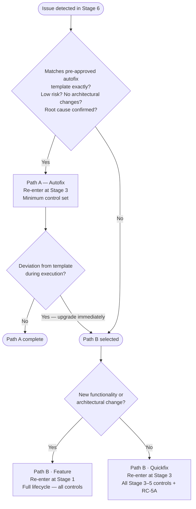

# Feedback Loops

When Stage 6 (Observability & Maintenance) detects an issue requiring a code change, work re-enters the lifecycle through one of two defined paths. These paths ensure no change bypasses governance controls — even under urgency.

Full process with roles, steps, and decision points: [process.md](process.md)

Full path definitions and minimum control sets: [feedback-loops.yaml](feedback-loops.yaml)

---

## Steps

| Step | Name | Delegation | When |
| ---- | ---- | ---------- | ---- |
| [FL.1](process.md#step-fl1--path-classification) | Path Classification | Human required | Every activation |
| [FL.2A](process.md#step-fl2a--path-a-autofix) | Path A — Autofix | Agent executes, OPS monitors | Path A selected |
| [FL.2B](process.md#step-fl2b--path-b-quickfix-or-feature) | Path B — Quickfix or Feature? | Human required | Path B selected or FL.2A deviation |
| [FL.3](process.md#step-fl3--path-b-quickfix-re-entry) | Path B — Quickfix Re-entry | Full Stage 3–5 governance | Quickfix selected |
| [FL.4](process.md#step-fl4--path-b-feature-re-entry) | Path B — Feature Re-entry | Full lifecycle from Stage 1 | Feature selected |
| [FL.5](process.md#step-fl5--activation-record--handover) | Activation Record & Handover | Agent creates, CO reviews | Every activation |

---

## Path A — Incident → Autofix

**Re-entry point:** Stage 3 (Coding & Implementation)

For low-risk issues that match a **pre-approved autofix template exactly**. If any eligibility condition is not met, the path must be upgraded to Path B immediately — no exceptions.

**Eligibility:**

- Issue matches a pre-approved autofix template exactly
- Risk classification is low
- No new architectural changes are introduced
- Root cause is confirmed (SA sign-off required for security-triggered issues)

**Minimum controls required:**

| Control | Stage | Rationale |
| ------- | ----- | --------- |
| QC-3A | 3 | All code changes must be reviewed before merge |
| QC-3B | 3 | Automated quality checks apply to autofix output |
| SC-3B | 3 | Agent-generated fix must be scanned for malicious patterns |
| SC-3C | 3 | Fix must not introduce exposed credentials |
| GC-3A | 3 | Autofix output must be attributed to the agent that produced it |
| QC-4A | 4 | Fix must be tested before deployment |
| SC-4A | 4 | Static security analysis is mandatory even for expedited paths |
| RC-4A | 4 | Residual risk must be assessed before deployment |
| SC-5B | 5 | Cryptographic verification that tested artefact matches deployed artefact |

**Regulatory basis:** DORA Art. 8(5), Art. 17(3)

---

## Path B — Bug/Change → Quickfix

**Re-entry point:** Stage 3 (Coding & Implementation)

For bugs requiring a targeted code fix that does not introduce new features or architectural changes. Also the mandatory upgrade path from Path A when eligibility conditions are not met.

**Minimum controls required:** All Stage 3, Stage 4, and Stage 5 controls, plus:

| Control | Rationale |
| ------- | --------- |
| RC-5A | CAB Approval is mandatory for all Quickfix deployments regardless of risk level — cannot be waived |

**Regulatory basis:** DORA Art. 8(1)

---

## Path B — Bug/Change → Feature Change

**Re-entry point:** Stage 1 (Intent Ingestion)

For changes requiring new functionality, architectural modification, or that are too complex to classify as a quickfix. No controls are skipped. The change is treated as a new feature request and goes through all six stages in sequence.

**Regulatory basis:** DORA Art. 8(1)

---

## Decision Tree

---

## Artifacts

**Input (from Stage 6):**

- [../stages/06-observability-maintenance/artifacts/outputs/slo-monitoring-record.yaml](../stages/06-observability-maintenance/artifacts/outputs/slo-monitoring-record.yaml) — QC-6A trigger source
- [../stages/06-observability-maintenance/artifacts/outputs/risk-health-monitoring-record.yaml](../stages/06-observability-maintenance/artifacts/outputs/risk-health-monitoring-record.yaml) — RC-6A trigger source
- [../stages/06-observability-maintenance/artifacts/outputs/incident-detection-record.yaml](../stages/06-observability-maintenance/artifacts/outputs/incident-detection-record.yaml) — SC-6A trigger source
- [../stages/06-observability-maintenance/artifacts/outputs/anomaly-detection-record.yaml](../stages/06-observability-maintenance/artifacts/outputs/anomaly-detection-record.yaml) — SC-6B trigger source
- [../stages/06-observability-maintenance/artifacts/outputs/ai-surveillance-report.yaml](../stages/06-observability-maintenance/artifacts/outputs/ai-surveillance-report.yaml) — AC-6A trigger source

**Outputs:**

- [artifacts/outputs/feedback-loop-activation-record.yaml](artifacts/outputs/feedback-loop-activation-record.yaml) — FL.5 output; one record per activation
- [artifacts/outputs/autofix-template.yaml](artifacts/outputs/autofix-template.yaml) — Template for defining pre-approved Path A patterns
