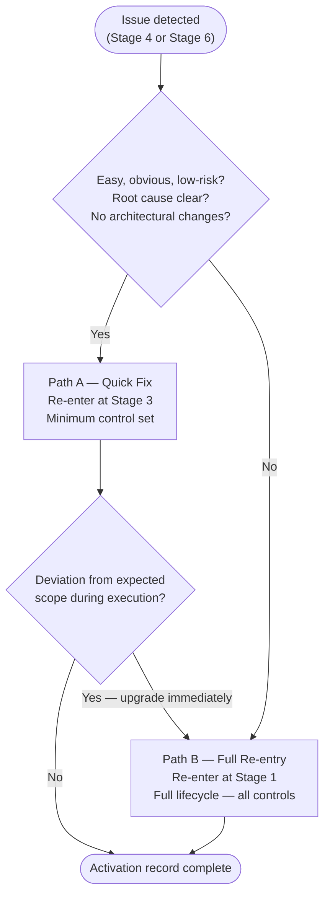

# Feedback Loops

> **Auto-generated from `feedbackloops/feedback-loops.yaml`**
>
> Do not edit this file directly. Edit the YAML source and run:
> ```bash
> python3 scripts/generate-docs.py
> ```

When Stage 4 (Testing & Documentation) or Stage 6 (Observability & Maintenance) detects an issue requiring a code change, work re-enters the lifecycle through one of two defined paths. These paths ensure no change bypasses governance controls — even under urgency.

Full process with roles, steps, and decision points: This document (auto-generated from feedback-loops.yaml)

Full path definitions and minimum control sets: [feedback-loops.yaml](feedback-loops.yaml)

---

## Roles

| Role | Code | Feedback Loop Responsibilities |
|------|------|-------------------------------|
| Agent | AGT | Detects Stage 4 or Stage 6 trigger; prepares activation record; re-executes minimum controls on Path A |
| Operations / SRE | OPS | First responder to Stage 6 alerts; co-classifies path; monitors Path A execution |
| QA Lead | QA | First responder to Stage 4 failures; co-classifies path; confirms root cause from test output |
| Security Architect | SA | Validates path classification for SC-12, SC-13, SC-19, and SC-20 triggers; confirms root cause before Path A is approved |
| Risk Officer | RO | Makes the formal path selection and classification decisions; provides signed approval for any Path B selection |
| Compliance Officer | CO | Reviews activation record; confirms DORA Art. 8 reporting obligations are documented |

---

## Steps Overview

| Step | Name | Delegation | When |
|------|------|------------|------|
| [FL.1](#step-fl.1) | Path Classification | Human required | Every activation |
| [FL.2A](#step-fl.2a) | Path A: Quick Fix | Agent executes minimum control set, OPS/QA monitors | Path A selected |
| [FL.2B](#step-fl.2b) | Path B: Full Re-entry | Full lifecycle from Stage 1 | Path B selected or FL.2A deviation |
| [FL.3](#step-fl.3) | Activation Record & Handover | Agent creates, CO reviews | Every activation |

---

## Path A — Quick Fix → Stage 3

**Re-entry point:** Stage 3 (Coding & Implementation)

For easy, obvious, low-risk issues with a clear root cause. Re-enters directly at Stage 3 with a minimum control set. If any eligibility condition is not met, Path B is mandatory — no exceptions.


**Eligibility — when triggered from Stage 6:**

- Issue matches a pre-approved autofix template exactly (no partial matches).
- Risk classification is low.
- No new architectural changes are required.
- Root cause is confirmed (SA sign-off required for SC-19 and SC-20 triggers).

**Eligibility — when triggered from Stage 4:**

- Root cause is unambiguous from the failing control output.
- Risk classification is low.
- No new architectural changes are required.
- Fix is isolated to code only — no schema, API, or contract changes.

**Minimum controls required:**

| Control | Stage | Rationale |
| ------- | ----- | --------- |
| QC-04 | 0 | All code changes must be reviewed before merge. |
| QC-05 | 0 | Automated quality checks apply to all fixes. |
| SC-08 | 0 | Agent-generated fix must be scanned for malicious patterns. |
| SC-09 | 0 | Fix must not introduce exposed credentials. |
| GC-03 | 0 | Fix output must be attributed to the agent or developer that produced it. |
| QC-06 | 0 | Fix must be tested before deployment. |
| SC-12 | 1 | Static security analysis is mandatory even for expedited paths. |
| RC-05 | 0 | Residual risk must be assessed before deployment. |
| SC-17 | 1 | Cryptographic verification that tested artefact matches deployed artefact. |

> When triggered from Stage 4, also re-execute the specific Stage 4 control(s) that raised the issue.

**Regulatory basis:** DORA Art. 8(5), Art. 17(3)

---

## Path B — Full Re-entry → Stage 1

**Re-entry point:** Stage 1 (Intent Ingestion)

For any issue not meeting Path A eligibility: complex bugs, new functionality requirements, architectural changes, or cases where root cause is unclear. No controls are skipped. The change is treated as a new feature request and goes through all six stages in sequence.

**Regulatory basis:** DORA Art. 8(1)

---

## Decision Tree



---

## Step FL.1 — Path Classification

**Delegation:** Human required — Runs first — blocks re-entry until path is formally approved


**Actor / Action:**

| Actor | Action |
| ----- | ------ |
| AGT | Retrieve the trigger: source stage (4 or 6), originating control, alert or finding ID, issue description |
| OPS / QA | Assess issue scope, urgency, and affected components; provide initial path recommendation |
| SA | For SC-12, SC-13, SC-19, or SC-20 triggers: confirm root cause is understood before any path is approved |
| RO | Make the formal path selection decision: Path A or Path B |
| RO | Record identity, role, timestamp, rationale, and selected path in the activation record |

**Path A eligibility — when triggered from Stage 6 (ALL conditions must be true):**

| Condition | Check |
|-----------|-------|
| Issue matches a pre-approved autofix template exactly (no partial matches) | AGT verifies against template registry |
| Risk classification of the issue is low | RO confirms |
| No new architectural changes are required | OPS confirms |
| Root cause is understood (for security-triggered issues: SA confirms) | SA / OPS confirms |

**Path A eligibility — when triggered from Stage 4 (ALL conditions must be true):**

| Condition | Check |
|-----------|-------|
| Root cause is unambiguous from the failing control output | QA / SA confirms |
| Risk classification is low | RO confirms |
| No new architectural changes are required | QA confirms |
| Fix is isolated to code only — no schema, API, or contract changes | QA confirms |

If any condition is not met, Path B is mandatory. Do not attempt a partial Path A.

| | |
| --- | --- |
| **Input** | Stage 4 or Stage 6 trigger record |
| **Output** | Signed path selection (Path A or Path B) recorded in the activation record |
| **On ambiguity** | Default to Path B — never assume Path A eligibility under uncertainty |

---

## Step FL.2A — Path A: Quick Fix

**Delegation:** Agent executes minimum control set, OPS/QA monitors — Runs after FL.1 (Path A selected)


**Actor / Action:**

| Actor | Action |
| ----- | ------ |
| AGT | For Stage 6 triggers: retrieve the matched pre-approved autofix template; verify exact signature match |
| AGT | Execute minimum controls in sequence: Stage 3 group, then Stage 4 group, then Stage 5 check |
| AGT | For Stage 4 triggers: additionally re-execute the specific Stage 4 control(s) that raised the issue |
| AGT | At any deviation from expected scope during execution: stop immediately; escalate to OPS/QA; upgrade to Path B |
| OPS / QA | Monitor execution continuously; validate no out-of-scope actions are taken |

**Minimum control set (in execution order):**

| Control | Stage | Rationale |
| ------- | ----- | --------- |
| QC-04 | 0 | All code changes must be reviewed before merge. |
| QC-05 | 0 | Automated quality checks apply to all fixes. |
| SC-08 | 0 | Agent-generated fix must be scanned for malicious patterns. |
| SC-09 | 0 | Fix must not introduce exposed credentials. |
| GC-03 | 0 | Fix output must be attributed to the agent or developer that produced it. |
| QC-06 | 0 | Fix must be tested before deployment. |
| SC-12 | 1 | Static security analysis is mandatory even for expedited paths. |
| RC-05 | 0 | Residual risk must be assessed before deployment. |
| SC-17 | 1 | Cryptographic verification that tested artefact matches deployed artefact. |

| | |
| --- | --- |
| **Input** | Stage 4 failing control output or matched Stage 6 autofix template + trigger record |
| **Output** | All minimum controls passed; change deployed via SC-17; activation record updated |
| **On deviation** | Immediately upgrade to Path B — do not attempt to continue with modifications |

---

## Step FL.2B — Path B: Full Re-entry

**Delegation:** Full lifecycle from Stage 1 — Runs after FL.1 (Path B selected) or upgrade from FL.2A


**Actor / Action:**

| Actor | Action |
| ----- | ------ |
| OPS / QA | Initiate Stage 1 re-entry; create a new FEAT-XXXX change request referencing the Stage 4 or Stage 6 trigger |
| All actors | Execute the full lifecycle: Stages 1 → 2 → 3 → 4 → 5 → Stage 6 monitoring re-activation |

| | |
| --- | --- |
| **Input** | Path B selection from FL.1 (or deviation upgrade from FL.2A) |
| **Output** | New FEAT-XXXX proceeding through full lifecycle; Stage 4/6 trigger linked in feature specification |
| **Linkage** | The trigger record ID must appear in the FEAT-XXXX feature specification's dependencies field |
| **On ambiguity** | Default to Path B — the full lifecycle is always the safe choice |

---

## Step FL.3 — Activation Record & Handover

**Delegation:** Agent creates, CO reviews — Runs at completion of every path


**Actor / Action:**

| Actor | Action |
| ----- | ------ |
| AGT | Complete the feedback-loop activation record: trigger source (Stage 4 or 6), control ID, path selected, approvals, re-entry ID, outcome |
| AGT | Link activation record to the GC-01 audit trail and to the resulting change's Stage 3 or Stage 1 evidence package |
| CO | Review activation record; confirm DORA Art. 8 documentation obligations are met |
| CO | For SC-19-triggered loops: confirm DORA Art. 19 reporting timelines are not impacted by the re-entry |

| | |
| --- | --- |
| **Output** | Activation record (artifacts/outputs/feedback-loop-activation-record.yaml) |
| **Retention** | 7 years (DORA Art. 8(6)) |

---

## Input Artifacts

**From Stage 4:**

| Artifact | Source Control | Source Step |
|----------|-----------------|-------------|
| SAST scan report | SC-12 | Step 4.1 |
| Test results report | QC-06 | Step 4.2 |
| DAST scan report | SC-13 | Step 4.3 |
| Risk threshold evaluation | RC-05 | Step 4.7 |

**From Stage 6:**

| Artifact | Source Control | Source Step |
|----------|-----------------|-------------|
| SLO monitoring record | QC-10 | Step 6.2 |
| Risk & health monitoring record | RC-08 | Step 6.3 |
| Incident detection record | SC-19 | Step 6.4 |
| Anomaly detection record | SC-20 | Step 6.5 |
| AI post-market surveillance report | AC-06 | Step 6.6 |

---

## Output Artifacts

| Artifact | Produced at | Template |
|----------|-------------|----------|
| Feedback Loop Activation Record | Step FL.3 | [artifacts/outputs/feedback-loop-activation-record.yaml](artifacts/outputs/feedback-loop-activation-record.yaml) |

---

**Last Updated:** 2026-03-09 21:43 UTC