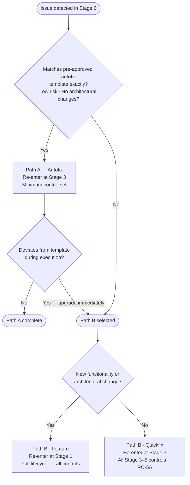

# Feedback Loops

When Stage 6 (Observability & Maintenance) detects an issue requiring a code change, work re-enters the lifecycle through one of two defined paths. These paths ensure no change bypasses governance controls — even under urgency.

Full path definitions and minimum control sets: [feedback-loops.yaml](feedback-loops.yaml)

---

## Path A — Incident → Autofix

**Re-entry point:** Stage 3 (Coding & Implementation)

For low-risk issues that match a **pre-approved autofix template exactly**. If any eligibility condition is not met, the path must be upgraded to Path B immediately — no exceptions.

**Eligibility:**

- Issue matches a pre-approved autofix template exactly
- Risk classification is low
- No new architectural changes are introduced

**Minimum controls required:**

| Control | Rationale |
| ------- | --------- |
| QC-3A | All code changes must be reviewed before merge |
| QC-3B | Automated quality checks apply to autofix output |
| SC-3B | Agent-generated fix must be scanned for malicious patterns |
| SC-3C | Fix must not introduce exposed credentials |
| GC-3A | Autofix output must be attributed to the agent that produced it |
| QC-4A | Fix must be tested before deployment |
| SC-4A | Static security analysis is mandatory even for expedited paths |
| RC-4A | Residual risk must be assessed before deployment |
| SC-5B | Cryptographic verification that tested artefact matches deployed artefact |

**Regulatory basis:** DORA Art. 8(5) (expedited changes must follow documented procedures), Art. 17(3) (incident response must follow defined procedures).

---

## Path B — Bug/Change → Quickfix

**Re-entry point:** Stage 3 (Coding & Implementation)

For bugs requiring a targeted code fix that does not introduce new features or architectural changes. Also the mandatory upgrade path from Path A when eligibility conditions are not met.

**Minimum controls required:** All Stage 3, Stage 4, and Stage 5 controls, plus:

| Control | Rationale |
| ------- | --------- |
| RC-5A | CAB Approval is mandatory for all quickfix deployments regardless of risk level |

**Regulatory basis:** DORA Art. 8(1) (ICT risk management framework must cover all changes — no exception for urgency).

---

## Path B — Bug/Change → Feature Change

**Re-entry point:** Stage 1 (Intent Ingestion)

For changes requiring new functionality, architectural modification, or that are too complex to classify as a quickfix. No controls are skipped. The change is treated as a new feature request and goes through all six stages in sequence.

**Regulatory basis:** DORA Art. 8(1) (ICT risk management framework must cover all changes — no exception for urgency).

---

## Decision Tree

