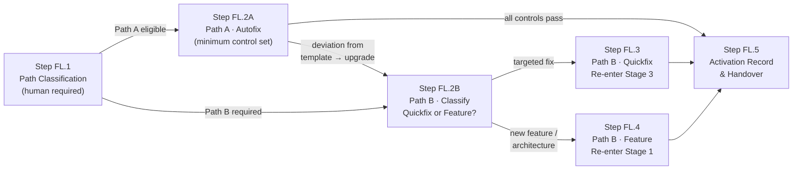

# Feedback Loops — Process

## Roles

Canonical role definitions: [../stages/roles.yaml](../stages/roles.yaml)

| Role | Short | Feedback loop responsibilities |
| ---- | ----- | ------------------------------ |
| Agent | AGT | Detects Stage 6 trigger; prepares activation record; re-executes minimum controls on Path A |
| Operations / SRE | OPS | First responder to Stage 6 alerts; co-classifies path; initiates Stage 3 re-entry for Quickfix |
| Security Architect | SA | Validates path classification for SC-6A and SC-6B triggers; confirms root cause before Path A is approved |
| Risk Officer | RO | Makes the formal path selection and classification decisions; provides signed approval for any Path B selection |
| Compliance Officer | CO | Reviews activation record; confirms DORA Art. 8 reporting obligations are documented |

## Input Artifacts

| Artifact | Source |
| -------- | ------ |
| SLO monitoring record | QC-6A (Step 6.2) |
| Risk & health monitoring record | RC-6A (Step 6.3) |
| Incident detection record | SC-6A (Step 6.4) |
| Anomaly detection record | SC-6B (Step 6.5) |
| AI post-market surveillance report | AC-6A (Step 6.6) |

---

## Step Sequence

Steps FL.1 and FL.5 run for every activation. Steps FL.2A or FL.2B → FL.3/FL.4 are selected based on the path classification made in FL.1.

---

## Step FL.1 — Path Classification

**Delegation:** Human required · **Runs first — blocks re-entry until path is formally approved**

| Actor | Action |
| ----- | ------ |
| AGT | Retrieve the Stage 6 trigger: originating control, alert or incident ID, issue description |
| OPS | Assess issue scope, urgency, and affected components; provide initial path recommendation |
| SA | For SC-6A or SC-6B triggers: confirm root cause is understood before any path is approved |
| RO | Make the formal path selection decision: Path A or Path B |
| RO | Record identity, role, timestamp, rationale, and selected path in the activation record |

**Path A eligibility — ALL conditions must be true:**

| Condition | Check |
| --------- | ----- |
| Issue matches a pre-approved autofix template exactly (no partial matches) | AGT verifies against template registry |
| Risk classification of the issue is `low` | RO confirms |
| No new architectural changes are required | OPS confirms |
| Root cause is understood (for security-triggered issues) | SA confirms |

If any condition is not met, Path B is mandatory. Do not attempt a partial Path A.

| | |
| --- | --- |
| **Input** | Stage 6 trigger record |
| **Output** | Signed path selection (Path A or Path B) recorded in the activation record |
| **On ambiguity** | Default to Path B — never assume Path A eligibility under uncertainty |

---

## Step FL.2A — Path A: Autofix

**Delegation:** Agent executes minimum control set, OPS monitors · **Runs after FL.1 — Path A selected**

| Actor | Action |
| ----- | ------ |
| AGT | Retrieve the matched pre-approved autofix template; verify exact signature match |
| AGT | Execute minimum controls in sequence: Stage 3 group, then Stage 4 group, then Stage 5 check |
| AGT | At any deviation from the template during execution: stop immediately; escalate to OPS; upgrade to Path B |
| OPS | Monitor execution continuously; validate no out-of-template actions are taken |

**Minimum control set (in execution order):**

| Control | Stage | Rationale |
| ------- | ----- | --------- |
| QC-3A | 3 | All code changes must be reviewed before merge |
| QC-3B | 3 | Automated quality checks apply to autofix output |
| SC-3B | 3 | Agent-generated fix must be scanned for malicious patterns |
| SC-3C | 3 | Fix must not introduce exposed credentials |
| GC-3A | 3 | Autofix output must be attributed to the agent that produced it |
| QC-4A | 4 | Fix must be tested before deployment |
| SC-4A | 4 | Static security analysis is mandatory even on expedited paths |
| RC-4A | 4 | Residual risk must be assessed before deployment |
| SC-5B | 5 | Cryptographic verification that tested artefact matches deployed artefact |

| | |
| --- | --- |
| **Input** | Matched autofix template + Stage 6 trigger |
| **Output** | All minimum controls passed; change deployed via SC-5B; activation record updated |
| **On deviation** | Immediately upgrade to Path B — do not attempt to continue Path A with modifications |

---

## Step FL.2B — Path B: Quickfix or Feature?

**Delegation:** Human required · **Runs after FL.1 (Path B selected) or upgrade from FL.2A**

| Actor | Action |
| ----- | ------ |
| RO | Determine whether the change requires (a) a targeted code fix with no new functionality — **Quickfix**, or (b) new functionality, architectural change, or complex remediation — **Feature** |
| RO | Record classification decision with identity, role, and timestamp |
| SA | Provide technical scope input for security-triggered issues |

**Classification criteria:**

| Quickfix | Feature |
| -------- | ------- |
| Targeted bug fix | New functionality required |
| No new user-visible features | Architectural change needed |
| No schema, API, or contract changes | Data migration or schema change required |
| Deployable within Stage 3–5 governance | Requires full lifecycle from Stage 1 |

| | |
| --- | --- |
| **Input** | Path B selection from FL.1 (or deviation upgrade from FL.2A) |
| **Output** | Quickfix → Step FL.3 · Feature → Step FL.4 |
| **On ambiguity** | Default to Feature path — the full lifecycle is always safe |

---

## Step FL.3 — Path B: Quickfix Re-entry

**Delegation:** Full Stage 3 → 4 → 5 governance · **Runs after FL.2B — Quickfix selected**

Re-enters at Stage 3 with all Stage 3, Stage 4, and Stage 5 controls fully executed. RC-5A (CAB Approval) is mandatory for all Quickfix deployments regardless of the original issue's risk tier.

| Actor | Action |
| ----- | ------ |
| OPS | Initiate Stage 3 re-entry; assign a hotfix tracking ID linked to the Stage 6 trigger |
| All actors | Execute all Stage 3 controls: SC-3A, QC-3B, RC-3A, SC-3B, SC-3C, QC-3A, GC-3A |
| All actors | Execute all Stage 4 controls (QC-4B and AC-4A applicable if AI components involved) |
| All actors | Execute all Stage 5 controls — RC-5A CAB Approval mandatory regardless of risk tier |

| | |
| --- | --- |
| **Input** | Quickfix classification from FL.2B |
| **Output** | Deployed fix with full Stage 3–5 evidence package; activation record updated |
| **On Stage 4 fail** | Return to Stage 3 per standard RC-4A fail procedure; update activation record |
| **RC-5A waiver** | RC-5A cannot be waived on the Quickfix path under any circumstances |

---

## Step FL.4 — Path B: Feature Re-entry

**Delegation:** Full lifecycle from Stage 1 · **Runs after FL.2B — Feature selected**

Re-enters at Stage 1. The change is treated as a new feature request and must complete all six stages in sequence. No stage or control may be skipped.

| Actor | Action |
| ----- | ------ |
| OPS | Initiate Stage 1 re-entry; create a new FEAT-XXXX change request referencing the Stage 6 trigger |
| All actors | Execute the full lifecycle: Stages 1 → 2 → 3 → 4 → 5 → Stage 6 monitoring re-activation |

| | |
| --- | --- |
| **Input** | Feature classification from FL.2B |
| **Output** | New FEAT-XXXX proceeding through full lifecycle; Stage 6 trigger linked in feature specification |
| **Linkage** | The Stage 6 trigger record ID must appear in the FEAT-XXXX feature specification's `dependencies` field |

---

## Step FL.5 — Activation Record & Handover

**Delegation:** Agent creates, CO reviews · **Runs at completion of every path**

| Actor | Action |
| ----- | ------ |
| AGT | Complete the feedback-loop activation record: trigger, path selected, approvals, re-entry ID, outcome |
| AGT | Link activation record to the GC-0A audit trail and to the resulting change's Stage 3 or Stage 1 evidence package |
| CO | Review activation record; confirm DORA Art. 8 documentation obligations are met |
| CO | For SC-6A-triggered loops: confirm DORA Art. 19 reporting timelines are not impacted by the re-entry |

| | |
| --- | --- |
| **Output** | Activation record (`artifacts/outputs/feedback-loop-activation-record.yaml`) |
| **Retention** | 7 years (DORA Art. 8(6)) |

---

## Output Artifacts

| Artifact | Produced at | Template |
| -------- | ----------- | -------- |
| Feedback Loop Activation Record | Step FL.5 | [artifacts/outputs/feedback-loop-activation-record.yaml](artifacts/outputs/feedback-loop-activation-record.yaml) |
