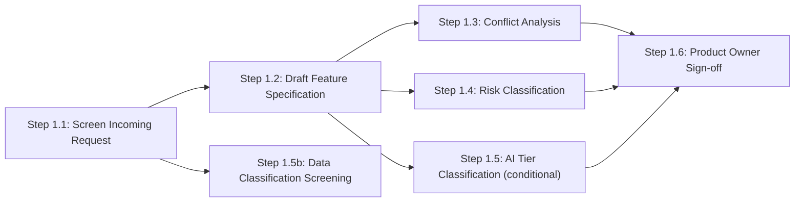

# Stage 1: Intent Ingestion

> **Auto-generated from `stages/01-intent-ingestion/01-intent-ingestion.yaml`**
>
> Do not edit this file directly. Edit the YAML source and run:
> ```bash
> python3 scripts/generate-docs.py
> ```

Capture, validate, and enrich an incoming change request into a structured, approved feature specification. All downstream stages depend on this specification as their source of truth. No design work begins until Stage 1 is complete.

---

## Overview

| Property | Value |
|----------|-------|
| **Stage** | 1 — Intent Ingestion |
| **Next Stage** | 2 |
| **Controls** | 8 required |
| **File** | [`stages/01-intent-ingestion/01-intent-ingestion.yaml`](stages/01-intent-ingestion/01-intent-ingestion.yaml) |

---

## Roles

The following roles participate in this stage:

| Role | Full Name | Responsibilities |
|------|-----------|------------------|
| REQ | Requester | Submits the change request |
| AGT | Agent | Screens, parses, drafts, classifies, and logs |
| PO | Product Owner | Approves specification; makes binding conflict decisions |
| RO | Risk Officer | Validates risk classification; may override agent-proposed tier |
| SA | Security Architect | Reviews blocked or flagged requests; contacts requester |
| AGL | AI Governance Lead | Confirms EU AI Act tier (if AI component involved) |
| CO | Compliance Officer | Reviews audit records during regulatory audits |

---

## Execution Workflow

The controls in this stage execute in the following order:



### Parallelism

The following steps may run in parallel:

- Step 1.3: Conflict Analysis, Step 1.4: Risk Classification, Step 1.5: AI Tier Classification (conditional)

Maximum concurrent steps: **3**

---

## Step-by-Step Process


### Step 1.1 — Screen Incoming Request

**Control:** [`SC-1A`](../../controls/sc/SC-1A.yaml) · **Delegation:** Fully automated


#### Actors and Actions

| Actor | Action |
|-------|--------|
| AGT | Scan raw change request for prompt injection patterns, adversarial framing, and manipulation attempts |
| AGT | Pass: forward to Step 1.2. Block: log attempt; notify SA |
| SA | Review blocked request; contact requester for resubmission |

#### Inputs and Outputs

| Property | Value |
|----------|-------|
| **Input** | Change Request (CR-XXXX) |
| **Output** | Screened request (pass) or blocked log entry |
| **On Failure** | SA reviews flagged request; requester must resubmit a clean change request |


### Step 1.2 — Draft Feature Specification

**Control:** [`QC-1A`](../../controls/qc/QC-1A.yaml) · **Delegation:** Agent drafts → human approves


#### Actors and Actions

| Actor | Action |
|-------|--------|
| AGT | Parse screened change request; populate FEAT-XXXX specification template |
| AGT | Identify any gaps in acceptance criteria or non-functional requirements |
| AGT | Flag gaps inline in the draft for Product Owner review |

#### Inputs and Outputs

| Property | Value |
|----------|-------|
| **Input** | Screened change request |
| **Output** | Draft feature specification (artifacts/outputs/feature-spec.yaml) |
| **Note** | Product Owner approval is at Step 1.6; this step only produces the draft |


### Step 1.3 — Conflict Analysis

**Control:** [`QC-1B`](../../controls/qc/QC-1B.yaml) · **Delegation:** Agent analyses, human resolves


#### Actors and Actions

| Actor | Action |
|-------|--------|
| AGT | Cross-reference all requirements; detect contradictions, competing priorities, and logical inconsistencies |
| AGT | Produce conflict map: each conflict rated blocking, significant, or minor, with resolution options |
| PO | Review conflict map; make binding decisions on all blocking conflicts |
| PO | Accept or document significant and minor conflicts with rationale |

#### Inputs and Outputs

| Property | Value |
|----------|-------|
| **Input** | Draft feature specification |
| **Output** | Conflict resolution record (artifacts/outputs/conflict-resolution-record.yaml) |
| **On Failure** | Unresolved blocking conflicts halt Stage 1. PO must resolve before proceeding |


### Step 1.4 — Risk Classification

**Control:** [`RC-1A`](../../controls/rc/RC-1A.yaml) · **Delegation:** Agent classifies, human validates


#### Actors and Actions

| Actor | Action |
|-------|--------|
| AGT | Apply risk classification criteria across 6 dimensions |
| AGT | Propose tier (low / medium / high / critical) and governance intensity |
| RO | Review proposed tier and rationale; validate or override with documented justification |

#### Inputs and Outputs

| Property | Value |
|----------|-------|
| **Input** | Draft feature specification |
| **Output** | Risk classification record (artifacts/outputs/risk-classification.yaml) |
| **On Failure** | Escalate to Risk Officer for manual assessment; classification must resolve before Step 1.6 |


### Step 1.5 — AI Tier Classification (conditional)

**Control:** [`AC-1A`](../../controls/ac/AC-1A.yaml) · **Delegation:** Agent proposes, human confirms

**Condition:** Only applicable when the change introduces, modifies, or interacts with AI components. If not applicable, document as not_applicable and skip human confirmation.


#### Actors and Actions

| Actor | Action |
|-------|--------|
| AGT | Analyse specification for AI component involvement |
| AGT | Propose EU AI Act risk tier with rationale referencing Art. 6 and Annex III |
| AGL | Review proposed tier and rationale; confirm or override with documented justification |

#### Inputs and Outputs

| Property | Value |
|----------|-------|
| **Input** | Draft feature specification |
| **Output** | AI tier classification (artifacts/outputs/ai-tier-classification.yaml) |
| **On Uncertainty** | Default to highest applicable tier pending AGL resolution |


### Step 1.5b — Data Classification Screening

**Control:** [`SC-1B`](../../controls/sc/SC-1B.yaml) · **Delegation:** Agent classifies, SA reviews

**Condition:** Only applicable when the change processes personal data or involves profiling. If not applicable, document as not_applicable.


#### Actors and Actions

| Actor | Action |
|-------|--------|
| AGT | Identify all personal data elements and processing activities |
| AGT | Classify each element per GDPR categories; flag any high-risk processing |
| SA | Review classification; confirm compliance with data handling policy |

#### Inputs and Outputs

| Property | Value |
|----------|-------|
| **Input** | Draft feature specification |
| **Output** | Data classification record (artifacts/outputs/data-classification-record.yaml) |
| **Note** | Runs in parallel with other checks after Step 1.1 |


### Step 1.6 — Product Owner Sign-off

**Control:** [`GC-1A`](../../controls/gc/GC-1A.yaml) · **Delegation:** Human required


#### Actors and Actions

| Actor | Action |
|-------|--------|
| PO | Review final specification, conflict resolutions, risk tier, and AI tier (if applicable) |
| PO | Approve: mark specification status: approved; Stage 1 may exit |
| PO | Reject: return to Step 1.2 with documented gaps; requester addresses them |

#### Inputs and Outputs

| Property | Value |
|----------|-------|
| **Input** | Draft spec + conflict resolution record + risk classification + AI tier classification |
| **Output** | Approved feature specification |
| **On Failure** | Return to Step 1.2; document reason; requester and agent address gaps |


---

## Required Controls


### SC-1A — Pre-Guardrails

- **Track:** SC
- **Delegation:** `fully_automated`
- **File:** [`controls/sc/SC-1A.yaml`](../../controls/sc/SC-1A.yaml)
- **Note:** Must run first — screens for adversarial inputs before any agent processing


### SC-1B — Data Classification & Sensitivity Screening

- **Track:** SC
- **Delegation:** `agent_classifies_human_validates`
- **File:** [`controls/sc/SC-1B.yaml`](../../controls/sc/SC-1B.yaml)
- **Note:** Applicable when the change processes personal data or involves profiling


### QC-1A — Specification Validation

- **Track:** QC
- **Delegation:** `agent_drafts_human_approves`
- **File:** [`controls/qc/QC-1A.yaml`](../../controls/qc/QC-1A.yaml)


### QC-1B — Coherence & Conflict Resolution

- **Track:** QC
- **Delegation:** `agent_analyses_human_resolves`
- **File:** [`controls/qc/QC-1B.yaml`](../../controls/qc/QC-1B.yaml)


### RC-1A — Risk Classification

- **Track:** RC
- **Delegation:** `agent_classifies_human_validates`
- **File:** [`controls/rc/RC-1A.yaml`](../../controls/rc/RC-1A.yaml)


### AC-1A — AI Risk Tier Classification

- **Track:** AC
- **Delegation:** `agent_proposes_human_confirms`
- **File:** [`controls/ac/AC-1A.yaml`](../../controls/ac/AC-1A.yaml)
- **Note:** Applicable when the change involves an AI component


### AC-1B — GPAI & Foundation Model Obligation Screening

- **Track:** AC
- **Delegation:** `agent_classifies_human_validates`
- **File:** [`controls/ac/AC-1B.yaml`](../../controls/ac/AC-1B.yaml)
- **Note:** Applicable when the change introduces or modifies use of a GPAI/foundation model


### GC-1A — Intent Traceability

- **Track:** GC
- **Delegation:** `fully_automated`
- **File:** [`controls/gc/GC-1A.yaml`](../../controls/gc/GC-1A.yaml)


---

## Input Artifacts

The following artifacts from prior stages are required as inputs:

- [`artifacts/inputs/change-request.yaml`](artifacts/inputs/change-request.yaml)

---

## Output Artifacts

This stage produces the following artifacts:

- [`artifacts/outputs/QC-1A-feature-spec.yaml`](artifacts/outputs/QC-1A-feature-spec.yaml)
- [`artifacts/outputs/QC-1B-conflict-resolution-record.yaml`](artifacts/outputs/QC-1B-conflict-resolution-record.yaml)
- [`artifacts/outputs/RC-1A-risk-classification.yaml`](artifacts/outputs/RC-1A-risk-classification.yaml)
- [`artifacts/outputs/AC-1A-ai-tier-classification.yaml`](artifacts/outputs/AC-1A-ai-tier-classification.yaml)
- [`artifacts/outputs/SC-1B-data-classification-record.yaml`](artifacts/outputs/SC-1B-data-classification-record.yaml)
- [`artifacts/outputs/GC-1A-intent-audit-record.yaml`](artifacts/outputs/GC-1A-intent-audit-record.yaml)

---


**Last Updated:** 2026-03-06 07:42 UTC