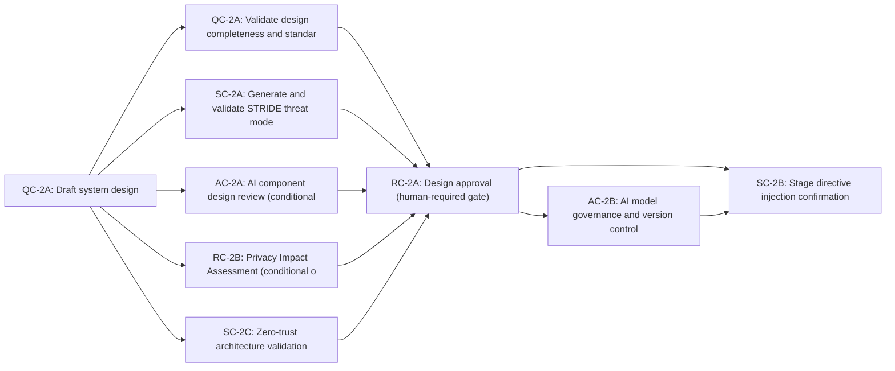

# Stage 2: System Design

> **Auto-generated from `stages/02-system-design/02-system-design.yaml`**
>
> Do not edit this file directly. Edit the YAML source and run:
> ```bash
> python3 scripts/generate-docs.py
> ```

Translate the approved specification into a complete, approved system design. Security directives are injected before coding begins. No implementation may start without RC-2A (design approval) and SC-2B directive injection confirmation.

---

## Overview

| Property | Value |
|----------|-------|
| **Stage** | 2 — System Design |
| **Next Stage** | 3 |
| **Controls** | 8 required |
| **File** | [`stages/02-system-design/02-system-design.yaml`](stages/02-system-design/02-system-design.yaml) |

---

## Roles

The following roles participate in this stage:

| Role | Full Name | Responsibilities |
|------|-----------|------------------|
| AGT | Agent | Drafts system design; generates threat model; injects directives |
| LAD | Lead Architect | Validates and approves design completeness and standards compliance |
| SA | Security Architect | Validates STRIDE threat model; signs and publishes directive payload |
| RO | Risk Officer | Makes formal design approval decision; determines sign-off authority by risk tier |
| AGL | AI Governance Lead | Reviews and approves AI component design (if AI component involved) |
| CO | Compliance Officer | Reviews design records during regulatory audits |

---

## Execution Workflow

The controls in this stage execute in the following order:



### Parallelism

The following controls may run in parallel:

- n-qc2a-validate, n-sc2a, n-ac2a, n-rc2b, n-sc2c

Maximum concurrent controls: **5**

---

## Step-by-Step Process


### Step 2.1 — Draft System Design

**Control:** [`QC-2A`](../../controls/qc/QC-2A.yaml) · **Delegation:** Agent drafts


#### Actors and Actions

| Actor | Action |
|-------|--------|
| AGT | Parse approved feature specification; translate requirements into architecture |
| AGT | Produce component diagram, integration map, data flow diagram, and technology decisions |
| AGT | Map every requirement to a specific architectural component; flag any unmapped requirements |
| AGT | Validate design coverage against organisational patterns; flag gaps and standards deviations |

#### Inputs and Outputs

| Property | Value |
|----------|-------|
| **Input** | Approved feature specification (FEAT-XXXX) |
| **Output** | Draft design document (artifacts/outputs/design-document.yaml) |
| **Note** | Lead Architect review is at Step 2.2; this step only produces the draft |


### Step 2.2 — Design Validation

**Control:** [`QC-2A`](../../controls/qc/QC-2A.yaml) · **Delegation:** Agent validates, LAD approves


#### Actors and Actions

| Actor | Action |
|-------|--------|
| LAD | Review draft design; verify all requirements are mapped to architectural components |
| LAD | Confirm design follows organisational architectural patterns and technology standards |
| LAD | Approve: advance to Step 2.5 package. Reject: return to Step 2.1 with documented gaps |

#### Inputs and Outputs

| Property | Value |
|----------|-------|
| **Input** | Draft design document |
| **Output** | Approved design document (artifacts/outputs/design-document.yaml — status: approved) |
| **On Failure** | Design returned to Step 2.1; LAD documents required changes |


### Step 2.3 — STRIDE Threat Modelling

**Control:** [`SC-2A`](../../controls/sc/SC-2A.yaml) · **Delegation:** Agent generates, SA validates


#### Actors and Actions

| Actor | Action |
|-------|--------|
| AGT | Identify all trust boundaries in the design |
| AGT | Generate STRIDE threat analysis across each trust boundary; propose mitigations for each threat |
| SA | Review threat model for completeness; validate proposed mitigations |
| SA | Accept: advance to Step 2.5 package. Reject: require design revision to address unmitigated threats |

#### Inputs and Outputs

| Property | Value |
|----------|-------|
| **Input** | Draft design document |
| **Output** | STRIDE threat model (artifacts/outputs/stride-threat-model.yaml) |
| **On Failure** | Unmitigated critical or high threats block Stage 2. Design must be revised |


### Step 2.4 — AI Component Design Review

**Control:** [`AC-2A`](../../controls/ac/AC-2A.yaml) · **Delegation:** Agent assists, AGL approves

**Condition:** Only applicable when the change introduces, modifies, or interacts with AI components. If not applicable, document as not_applicable and skip human confirmation.


#### Actors and Actions

| Actor | Action |
|-------|--------|
| AGT | Analyse design for AI component involvement |
| AGT | Validate model selection, data pipeline design, explainability mechanisms, and human oversight provisions against AI Act requirements |
| AGL | Review AI design validation; confirm or require revisions |

#### Inputs and Outputs

| Property | Value |
|----------|-------|
| **Input** | Draft design document + AI tier classification from Stage 1 |
| **Output** | AI component design review (artifacts/outputs/ai-component-design-review.yaml) |
| **On Uncertainty** | Default to most restrictive AI Act obligations pending AGL resolution |


### Step 2.3b — Privacy Impact Assessment

**Control:** [`RC-2B`](../../controls/rc/RC-2B.yaml) · **Delegation:** Agent generates, LAD reviews

**Condition:** Only applicable when the change processes personal data, involves profiling, or high-risk AI processing. If not applicable, document as not_applicable.


#### Actors and Actions

| Actor | Action |
|-------|--------|
| AGT | Identify all personal data processing activities in the design |
| AGT | Assess privacy risks across: lawfulness, necessity, minimization, retention, recipient access |
| LAD | Review PIA; confirm privacy safeguards are adequate |

#### Inputs and Outputs

| Property | Value |
|----------|-------|
| **Input** | Draft design document |
| **Output** | Privacy Impact Assessment (artifacts/outputs/privacy-impact-assessment.yaml) |
| **On Failure** | Unacceptable privacy risks block Stage 2; design must be revised |


### Step 2.3c — Zero-Trust Architecture Validation

**Control:** [`SC-2C`](../../controls/sc/SC-2C.yaml) · **Delegation:** Fully automated


#### Actors and Actions

| Actor | Action |
|-------|--------|
| AGT | Validate design against zero-trust principles; verify all network segments require authentication |
| AGT | Check encryption of all data in motion and at rest; verify principle of least privilege |
| SA | Review validation results; approve or require mitigations |

#### Inputs and Outputs

| Property | Value |
|----------|-------|
| **Input** | Draft design document |
| **Output** | Zero-trust validation report (artifacts/outputs/zero-trust-validation.yaml) |
| **On Failure** | Critical deviations from zero-trust architecture block Stage 2 |


### Step 2.5 — Design Approval

**Control:** [`RC-2A`](../../controls/rc/RC-2A.yaml) · **Delegation:** Human required


#### Actors and Actions

| Actor | Action |
|-------|--------|
| AGT | Assemble approval package: design document, threat model, AI review (if applicable), risk tier |
| RO | Review approval package; make formal approval decision |
| RO | Approve: record decision with identity and timestamp; advance to Step 2.6 |
| RO | Reject: return to Step 2.1 with documented reasons; no coding may begin |

#### Inputs and Outputs

| Property | Value |
|----------|-------|
| **Input** | Approved design doc + STRIDE threat model + AI review + Stage 1 risk classification |
| **Output** | Design approval decision (artifacts/outputs/design-approval-decision.yaml) |
| **On Failure** | Return to Step 2.1; document reason; revise design and restart parallel steps |


**Sign-off authority by risk tier**

| Risk Tier | Required Authority |
| --- | --- |
| critical | Senior Architecture Board |
| high | Senior Architecture Board |
| medium | Lead Architect |
| low | Lead Architect (may be pre-approved) |


### Step 2.6 — AI Model Governance and Version Control

**Control:** [`AC-2B`](../../controls/ac/AC-2B.yaml) · **Delegation:** Agent registers, AGL approves

**Condition:** Only applicable when the change introduces or modifies use of a GPAI or foundation model. If not applicable, document as not_applicable.


#### Actors and Actions

| Actor | Action |
|-------|--------|
| AGT | Register all models in the model registry with versioning metadata |
| AGT | Record model lineage, data sources, training dates, and performance baselines |
| AGL | Approve model registry entries and version pinning |

#### Inputs and Outputs

| Property | Value |
|----------|-------|
| **Input** | Approved design document + AI component design review |
| **Output** | AI model governance record (artifacts/outputs/ai-model-governance-record.yaml) |
| **Note** | Runs after design approval (RC-2A) |


### Step 2.7 — Stage Directive Injection

**Control:** [`SC-2B`](../../controls/sc/SC-2B.yaml) · **Delegation:** Fully automated


#### Actors and Actions

| Actor | Action |
|-------|--------|
| AGT | Receive signed Stage 2 and Stage 3 directive payloads; load into agent context |
| AGT | Acknowledge receipt of both payloads with confirmation |

#### Inputs and Outputs

| Property | Value |
|----------|-------|
| **Input** | directives/stages/02-system-design.yaml · directives/stages/03-coding-implementation.yaml |
| **Output** | Directive injection confirmation (artifacts/outputs/directive-injection-confirmation.yaml) |
| **On Failure** | Stage 2 completion is blocked; Stage 3 cannot begin until injection is confirmed |


---

## Required Controls


### QC-2A — Design Completeness & Standards

- **Track:** QC
- **Delegation:** `agent_drafts_human_approves`
- **File:** [`controls/qc/QC-2A.yaml`](../../controls/qc/QC-2A.yaml)


### RC-2A — Design Approval

- **Track:** RC
- **Delegation:** `human_required`
- **File:** [`controls/rc/RC-2A.yaml`](../../controls/rc/RC-2A.yaml)
- **Note:** Human-required gate — cannot be delegated to an agent


### RC-2B — Privacy Impact Assessment Gate

- **Track:** RC
- **Delegation:** `agent_analyses_human_resolves`
- **File:** [`controls/rc/RC-2B.yaml`](../../controls/rc/RC-2B.yaml)
- **Note:** Applicable when the change involves personal data, profiling, or high-risk AI systems


### SC-2A — Threat Model Validation

- **Track:** SC
- **Delegation:** `agent_drafts_human_approves`
- **File:** [`controls/sc/SC-2A.yaml`](../../controls/sc/SC-2A.yaml)


### SC-2C — Zero-Trust Architecture Validation

- **Track:** SC
- **Delegation:** `agent_analyses_human_resolves`
- **File:** [`controls/sc/SC-2C.yaml`](../../controls/sc/SC-2C.yaml)
- **Note:** Validate zero-trust architecture principles in design


### SC-2B — Stage Directive Injection

- **Track:** SC
- **Delegation:** `automated_policy_enforced`
- **File:** [`controls/sc/SC-2B.yaml`](../../controls/sc/SC-2B.yaml)
- **Note:** Directive injection must be confirmed before Stage 3 begins


### AC-2A — AI Component Design Review

- **Track:** AC
- **Delegation:** `agent_drafts_human_approves`
- **File:** [`controls/ac/AC-2A.yaml`](../../controls/ac/AC-2A.yaml)
- **Note:** Applicable when the change involves an AI component


### AC-2B — AI Model Governance & Version Control

- **Track:** AC
- **Delegation:** `agent_creates_human_reviews`
- **File:** [`controls/ac/AC-2B.yaml`](../../controls/ac/AC-2B.yaml)
- **Note:** Applicable when the change involves AI models — register in model registry


---

## Input Artifacts

The following artifacts from prior stages are required as inputs:

- [`../01-intent-ingestion/artifacts/outputs/QC-1A-feature-spec.yaml`](../01-intent-ingestion/artifacts/outputs/QC-1A-feature-spec.yaml)
- [`../01-intent-ingestion/artifacts/outputs/RC-1A-risk-classification.yaml`](../01-intent-ingestion/artifacts/outputs/RC-1A-risk-classification.yaml)

---

## Output Artifacts

This stage produces the following artifacts:

- [`artifacts/outputs/QC-2A-design-document.yaml`](artifacts/outputs/QC-2A-design-document.yaml)
- [`artifacts/outputs/SC-2A-stride-threat-model.yaml`](artifacts/outputs/SC-2A-stride-threat-model.yaml)
- [`artifacts/outputs/RC-2A-design-approval-decision.yaml`](artifacts/outputs/RC-2A-design-approval-decision.yaml)
- [`artifacts/outputs/SC-2B-directive-injection-confirmation.yaml`](artifacts/outputs/SC-2B-directive-injection-confirmation.yaml)
- [`artifacts/outputs/AC-2A-ai-component-design-review.yaml`](artifacts/outputs/AC-2A-ai-component-design-review.yaml)
- [`artifacts/outputs/RC-2B-privacy-impact-assessment.yaml`](artifacts/outputs/RC-2B-privacy-impact-assessment.yaml)
- [`artifacts/outputs/SC-2C-zero-trust-validation.yaml`](artifacts/outputs/SC-2C-zero-trust-validation.yaml)
- [`artifacts/outputs/AC-2B-ai-model-governance-record.yaml`](artifacts/outputs/AC-2B-ai-model-governance-record.yaml)

---


## Directives

The following directives are injected at the entry to this stage:

- [`directives/stages/02-system-design.yaml`](../../directives/stages/02-system-design.yaml)
- [`directives/stages/03-coding-implementation.yaml`](../../directives/stages/03-coding-implementation.yaml)

---


**Last Updated:** 2026-03-05 20:32 UTC