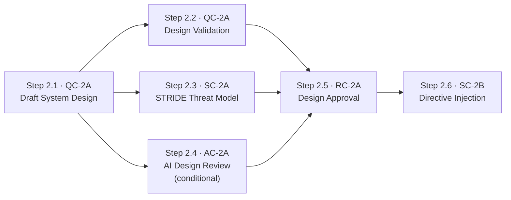

# Stage 2: System Design — Process

## Roles

Canonical role definitions: [../roles.yaml](../roles.yaml)

| Role | Short | Stage 2 responsibilities |
| ---- | ----- | ------------------------- |
| Agent | AGT | Drafts system design; generates threat model; injects directives |
| Lead Architect | LAD | Validates and approves design completeness and standards compliance |
| Security Architect | SA | Validates STRIDE threat model; signs and publishes directive payload |
| Risk Officer | RO | Makes formal design approval decision; determines sign-off authority by risk tier |
| AI Governance Lead | AGL | Reviews and approves AI component design (if AI component involved) |
| Compliance Officer | CO | Reviews design records during regulatory audits |

## Input Artifacts

| Artifact | Provided by | Source |
| -------- | ----------- | ------ |
| Approved Feature Specification | Stage 1 QC-1A | [../01-intent-ingestion/artifacts/outputs/feature-spec.yaml](../01-intent-ingestion/artifacts/outputs/feature-spec.yaml) |

---

## Step Sequence

Steps 2.2, 2.3, and 2.4 are independent of each other and run in parallel after Step 2.1 completes.

---

## Step 2.1 — Draft System Design

**Control:** [QC-2A](../../controls/qc/QC-2A.yaml) (agent phase) · **Delegation:** Agent drafts · **Runs after:** Stage 1 approval

| Actor | Action |
| ----- | ------ |
| AGT | Parse approved feature specification; translate requirements into architecture |
| AGT | Produce component diagram, integration map, data flow diagram, and technology decisions |
| AGT | Map every requirement to a specific architectural component; flag any unmapped requirements |
| AGT | Validate design coverage against organisational patterns; flag gaps and standards deviations |

| | |
| --- | --- |
| **Input** | Approved feature specification (`FEAT-XXXX`) |
| **Output** | Draft design document (`artifacts/outputs/design-document.yaml`) |
| **Note** | Lead Architect review is at Step 2.2; this step only produces the draft |

---

## Steps 2.2, 2.3, 2.4 — Run in parallel after Step 2.1

---

## Step 2.2 — Design Validation

**Control:** [QC-2A](../../controls/qc/QC-2A.yaml) (approval phase) · **Delegation:** Agent validates, LAD approves · **Runs after:** Step 2.1 · **Parallel with:** Steps 2.3 and 2.4

| Actor | Action |
| ----- | ------ |
| LAD | Review draft design; verify all requirements are mapped to architectural components |
| LAD | Confirm design follows organisational architectural patterns and technology standards |
| LAD | **Approve:** advance to Step 2.5 package. **Reject:** return to Step 2.1 with documented gaps |

| | |
| --- | --- |
| **Input** | Draft design document |
| **Output** | Approved design document (`artifacts/outputs/design-document.yaml` — status: approved) |
| **On failure** | Design returned to Step 2.1; LAD documents required changes |

---

## Step 2.3 — STRIDE Threat Modelling

**Control:** [SC-2A](../../controls/sc/SC-2A.yaml) · **Delegation:** Agent generates, SA validates · **Runs after:** Step 2.1 · **Parallel with:** Steps 2.2 and 2.4

| Actor | Action |
| ----- | ------ |
| AGT | Identify all trust boundaries in the design |
| AGT | Generate STRIDE threat analysis across each trust boundary; propose mitigations for each threat |
| SA | Review threat model for completeness; validate proposed mitigations |
| SA | **Accept:** advance to Step 2.5 package. **Reject:** require design revision to address unmitigated threats |

| | |
| --- | --- |
| **Input** | Draft design document |
| **Output** | STRIDE threat model (`artifacts/outputs/stride-threat-model.yaml`) |
| **On failure** | Unmitigated critical or high threats block Stage 2. Design must be revised |

---

## Step 2.4 — AI Component Design Review *(conditional)*

**Control:** [AC-2A](../../controls/ac/AC-2A.yaml) · **Delegation:** Agent assists, AGL approves · **Runs after:** Step 2.1 · **Parallel with:** Steps 2.2 and 2.3

**Condition:** Only applicable when the change introduces, modifies, or interacts with AI components. If not applicable, document as `not_applicable` and skip human confirmation.

| Actor | Action |
| ----- | ------ |
| AGT | Analyse design for AI component involvement |
| AGT | Validate model selection, data pipeline design, explainability mechanisms, and human oversight provisions against AI Act requirements |
| AGL | Review AI design validation; confirm or require revisions |

| | |
| --- | --- |
| **Input** | Draft design document + AI tier classification from Stage 1 |
| **Output** | AI component design review (`artifacts/outputs/ai-component-design-review.yaml`) |
| **On uncertainty** | Default to most restrictive AI Act obligations pending AGL resolution |

---

## Step 2.5 — Design Approval

**Control:** [RC-2A](../../controls/rc/RC-2A.yaml) · **Delegation:** Human required · **Runs after:** Steps 2.2, 2.3, and 2.4 all complete

**Sign-off authority is determined by the risk tier from Stage 1 RC-1A:**

| Risk Tier | Required Authority |
| --------- | ------------------ |
| critical | Senior Architecture Board |
| high | Senior Architecture Board |
| medium | Lead Architect |
| low | Lead Architect (may be pre-approved) |

| Actor | Action |
| ----- | ------ |
| AGT | Assemble approval package: design document, threat model, AI review (if applicable), risk tier |
| RO | Review approval package; make formal approval decision |
| RO | **Approve:** record decision with identity and timestamp; advance to Step 2.6 |
| RO | **Reject:** return to Step 2.1 with documented reasons; no coding may begin |

| | |
| --- | --- |
| **Input** | Approved design doc + STRIDE threat model + AI review + Stage 1 risk classification |
| **Output** | Design approval decision (`artifacts/outputs/design-approval-decision.yaml`) |
| **On rejection** | Return to Step 2.1; document reason; revise design and restart parallel steps |

---

## Step 2.6 — Directive Injection

**Control:** [SC-2B](../../controls/sc/SC-2B.yaml) · **Delegation:** Fully automated · **Runs after:** Step 2.5 (approval)

| Actor | Action |
| ----- | ------ |
| AGT | Receive signed Core Security Directives payload; load into agent context |
| AGT | Acknowledge receipt with cryptographic confirmation |

| | |
| --- | --- |
| **Input** | [directives/core-security-directives.xml](directives/core-security-directives.xml) (signed payload) |
| **Output** | Directive injection confirmation (`artifacts/outputs/directive-injection-confirmation.yaml`) |
| **On failure** | Stage 2 completion is blocked; Stage 3 cannot begin until injection is confirmed |

---

## Output Artifacts

| Artifact | Produced at | Control | Template |
| -------- | ----------- | ------- | -------- |
| Design Document | Step 2.1 / Step 2.2 | QC-2A | [artifacts/outputs/design-document.yaml](artifacts/outputs/design-document.yaml) |
| STRIDE Threat Model | Step 2.3 | SC-2A | [artifacts/outputs/stride-threat-model.yaml](artifacts/outputs/stride-threat-model.yaml) |
| AI Component Design Review | Step 2.4 | AC-2A | [artifacts/outputs/ai-component-design-review.yaml](artifacts/outputs/ai-component-design-review.yaml) |
| Design Approval Decision | Step 2.5 | RC-2A | [artifacts/outputs/design-approval-decision.yaml](artifacts/outputs/design-approval-decision.yaml) |
| Directive Injection Confirmation | Step 2.6 | SC-2B | [artifacts/outputs/directive-injection-confirmation.yaml](artifacts/outputs/directive-injection-confirmation.yaml) |
