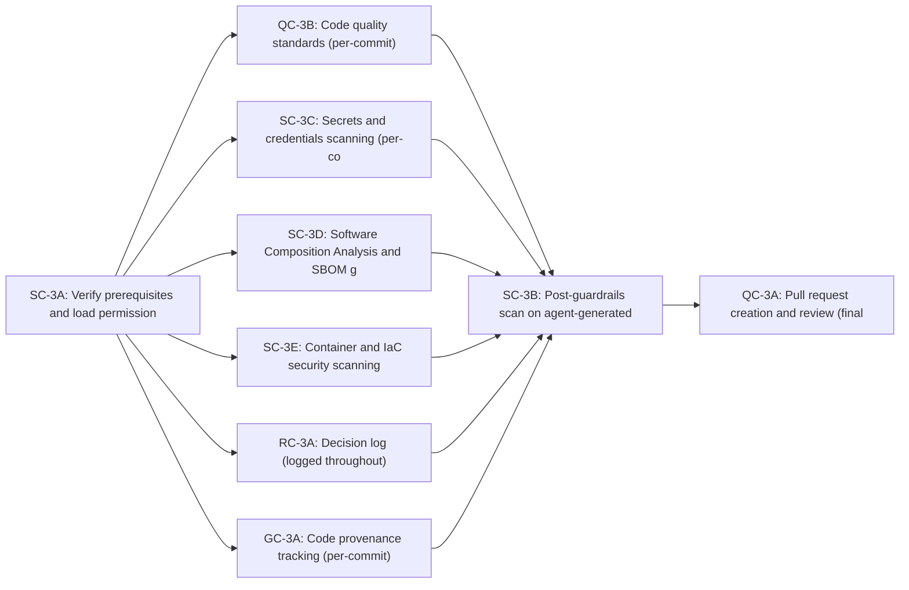

# Stage 3: Coding & Implementation

> **Auto-generated from `stages/03-coding-implementation/03-coding-implementation.yaml`**
>
> Do not edit this file directly. Edit the YAML source and run:
> ```bash
> python3 scripts/generate-docs.py
> ```

Implement the approved design under continuous automated quality and security controls. All implementation — human, agent, or co-authored — converges into a reviewed and approved pull request before Stage 4 begins.

---

## Overview

| Property | Value |
|----------|-------|
| **Stage** | 3 — Coding & Implementation |
| **Next Stage** | 4 |
| **Controls** | 9 required |
| **File** | [`stages/03-coding-implementation/03-coding-implementation.yaml`](stages/03-coding-implementation/03-coding-implementation.yaml) |

---

## Roles

The following roles participate in this stage:

| Role | Full Name | Responsibilities |
|------|-----------|------------------|
| AGT | Agent | Writes code; logs decisions (RC-3A); tags provenance (GC-3A); scans output (SC-3B); creates pull request (QC-3A) |
| DEV | Developer | Authors human-written code; reviews pull request; approves; escalation reviewer for high/critical risk tiers |
| SA | Security Architect | Defines and maintains agent permission policy (SC-3A); reviews violation logs; escalation target for SC-3B and SC-3C findings |
| CO | Compliance Officer | Reviews code provenance records and audit artefacts during regulatory audits |

---

## Execution Workflow

The controls in this stage execute in the following order:



### Parallelism

The following controls may run in parallel:

- n-qc3b, n-sc3c, n-sc3d, n-sc3e, n-rc3a, n-gc3a

Maximum concurrent controls: **6**

---

## Step-by-Step Process


### Step 3.1 — Verify Prerequisites & Load Permissions

**Control:** [`SC-3A`](../../controls/sc/SC-3A.yaml) · **Delegation:** Fully automated


#### Actors and Actions

| Actor | Action |
|-------|--------|
| AGT | Verify that SC-2B directive injection confirmation exists and covers Stage 3 directives |
| AGT | Load agent trust tier and permission policy from SC-3A |
| AGT | Confirm that directives/stages/03-coding-implementation.yaml has been acknowledged |
| SA | Confirms permission policy is up to date for the agent trust tier |

#### Inputs and Outputs

| Property | Value |
|----------|-------|
| **Input** | Directive injection confirmation (Stage 2 SC-2B output) |
| **Output** | Permission enforcement log started (artifacts/outputs/permission-enforcement-log.yaml) |
| **On Failure** | Stage 3 cannot begin. Missing directive confirmation or invalid permission policy must be resolved before any coding starts |


### Step 3.2 — Implementation Loop

**Control:** [`QC-3B`](../../controls/qc/QC-3B.yaml) · **Delegation:** Agent implements, DEV authors


#### Actors and Actions

| Actor | Action |
|-------|--------|
| AGT | Implement code against the approved Stage 2 design document |
| AGT | Tag all agent-generated code with provenance metadata at point of generation (GC-3A → GC-0C registry) |
| AGT | Commit; QC-3B runs quality gates and SC-3C scans for secrets automatically |
| AGT | Log all significant autonomous decisions to the decision log (RC-3A): rationale, alternatives considered |
| DEV | Review and triage any QC-3B violations or SC-3C blocked commits; resolve before re-committing |
| AGT | Repeat until all design requirements are implemented |

#### Inputs and Outputs

| Property | Value |
|----------|-------|
| **Input** | Approved design document |
| **Output** | Quality gate report (artifacts/outputs/quality-gate-report.yaml) · Secrets scan report (artifacts/outputs/secrets-scan-report.yaml) · Decision log (artifacts/outputs/decision-log.yaml) |
| **On Failure** | Commit blocked; developer resolves violations and re-commits |
| **Note** | This step is the main implementation loop. All four controls run continuously — QC-3B and SC-3C on every commit, GC-3A at the point of generation, RC-3A whenever a significant decision is made. Repeats on every commit. |


### Step 3.2-sc3c — Secrets Scanning

**Control:** [`SC-3C`](../../controls/sc/SC-3C.yaml) · **Delegation:** Fully automated


#### Actors and Actions

| Actor | Action |
|-------|--------|
| AGT | Scan every commit for exposed secrets, API keys, and credentials |
| DEV | On secret detection: remove secret, rotate the credential, and re-commit |

#### Inputs and Outputs

| Property | Value |
|----------|-------|
| **Input** | Code commits |
| **Output** | Secrets scan report (artifacts/outputs/secrets-scan-report.yaml) |
| **On Failure** | Commit blocked; secrets must be removed before committing |


### Step 3.2-sc3d — Software Composition Analysis

**Control:** [`SC-3D`](../../controls/sc/SC-3D.yaml) · **Delegation:** Fully automated


#### Actors and Actions

| Actor | Action |
|-------|--------|
| AGT | Generate SBOM; scan all third-party dependencies for known CVEs |
| SA | Review critical/high findings; document risk acceptance if needed |

#### Inputs and Outputs

| Property | Value |
|----------|-------|
| **Input** | Dependency manifests (package.json, requirements.txt, etc.) |
| **Output** | SCA report with SBOM (artifacts/outputs/sca-report.yaml) |
| **On Failure** | Critical or unaccepted dependencies block progression |


### Step 3.2-sc3e — Container & IaC Security Scanning

**Control:** [`SC-3E`](../../controls/sc/SC-3E.yaml) · **Delegation:** Fully automated


#### Actors and Actions

| Actor | Action |
|-------|--------|
| AGT | Scan all container images and IaC manifests (Terraform, CloudFormation, etc.) for misconfigurations |
| SA | Triage findings; remediate or document risk acceptance |

#### Inputs and Outputs

| Property | Value |
|----------|-------|
| **Input** | Container images and IaC manifests |
| **Output** | Container and IaC security report (artifacts/outputs/container-iac-security-report.yaml) |
| **On Failure** | Critical misconfigurations block progression |


### Step 3.2-rc3a — Decision Logging

**Control:** [`RC-3A`](../../controls/rc/RC-3A.yaml) · **Delegation:** Agent logs, DEV reviews


#### Actors and Actions

| Actor | Action |
|-------|--------|
| AGT | Log all significant autonomous decisions: rationale, alternatives considered, decision owner |
| DEV | Review decision log; flag any gaps or unexplained decisions |

#### Inputs and Outputs

| Property | Value |
|----------|-------|
| **Input** | Implementation activities |
| **Output** | Decision log (artifacts/outputs/decision-log.yaml) |
| **On Failure** | Unresolved decision log gaps block Stage 3 exit |


### Step 3.2-gc3a — Code Provenance Tracking

**Control:** [`GC-3A`](../../controls/gc/GC-3A.yaml) · **Delegation:** Fully automated


#### Actors and Actions

| Actor | Action |
|-------|--------|
| AGT | Tag all agent-generated code with provenance metadata (author, model, date, commitment) at point of generation |
| AGT | Register tags in GC-0C provenance registry |

#### Inputs and Outputs

| Property | Value |
|----------|-------|
| **Input** | Generated code |
| **Output** | Provenance registry entries |
| **Note** | Runs continuously throughout implementation; all code must be tagged |


### Step 3.3 — Agent Output Scan

**Control:** [`SC-3B`](../../controls/sc/SC-3B.yaml) · **Delegation:** Fully automated


#### Actors and Actions

| Actor | Action |
|-------|--------|
| AGT | Trigger SC-3B scan across all agent-generated code in the branch |
| AGT | Report findings: file, line, category, severity |
| SA | Review any flagged findings; determine resolution |
| AGT | Block PR creation if any critical or high findings remain unresolved |

#### Inputs and Outputs

| Property | Value |
|----------|-------|
| **Input** | All agent-generated code on the branch |
| **Output** | Post-guardrail scan result (artifacts/outputs/post-guardrail-scan.yaml) |
| **On Failure** | PR creation is blocked (Step 3.4 cannot begin); SA reviews and remediates findings |


### Step 3.4 — Pull Request Creation

**Control:** [`QC-3A`](../../controls/qc/QC-3A.yaml) · **Delegation:** Agent creates, humans review


#### Actors and Actions

| Actor | Action |
|-------|--------|
| AGT | Assemble evidence package: all Stage 3 control outputs |
| AGT | Create pull request from feature branch to target branch |
| AGT | Attach all evidence artefacts to the PR |
| AGT | Assign reviewers per risk tier from Stage 1 RC-1A |
| DEV | Review code changes against the approved design document |
| DEV | Review all Stage 3 evidence artefacts (quality gate report, decision log, scan results) |
| DEV | Request changes or approve; all requested changes must be resolved before re-review |
| DEV | Approve: record identity and timestamp; PR is eligible for merge |
| AGT | Update pull request record with approval details |

#### Inputs and Outputs

| Property | Value |
|----------|-------|
| **Input** | All Stage 3 control outputs + approved design document |
| **Output** | Pull request record (artifacts/outputs/pull-request-record.yaml) — status: approved |
| **On Failure** | If PR cannot be created or is rejected, return to Step 3.2 for remediation |


**Reviewer assignment by risk tier**

| Risk Tier | Required Reviewers |
| --- | --- |
| critical | Lead Architect + Security Architect (minimum 2) |
| high | Lead Architect + 1 peer developer (minimum 2) |
| medium | 2 peer developers |
| low | 1 peer developer |


---

## Required Controls


### QC-3B — Code Quality Standards

- **Track:** QC
- **Delegation:** `fully_automated`
- **File:** [`controls/qc/QC-3B.yaml`](../../controls/qc/QC-3B.yaml)
- **Note:** Runs continuously on every commit


### SC-3A — Permission Management

- **Track:** SC
- **Delegation:** `automated_policy_enforced`
- **File:** [`controls/sc/SC-3A.yaml`](../../controls/sc/SC-3A.yaml)
- **Note:** Enforced throughout the implementation session


### SC-3B — Post-Guardrails

- **Track:** SC
- **Delegation:** `fully_automated`
- **File:** [`controls/sc/SC-3B.yaml`](../../controls/sc/SC-3B.yaml)
- **Note:** Runs on all agent-generated code before PR creation


### SC-3C — Secrets & Credentials Scanning

- **Track:** SC
- **Delegation:** `fully_automated`
- **File:** [`controls/sc/SC-3C.yaml`](../../controls/sc/SC-3C.yaml)
- **Note:** Runs on every commit


### SC-3D — Software Composition Analysis & SBOM Generation

- **Track:** SC
- **Delegation:** `fully_automated`
- **File:** [`controls/sc/SC-3D.yaml`](../../controls/sc/SC-3D.yaml)
- **Note:** Scans all third-party dependencies for known vulnerabilities


### SC-3E — Container & IaC Security Scanning

- **Track:** SC
- **Delegation:** `fully_automated`
- **File:** [`controls/sc/SC-3E.yaml`](../../controls/sc/SC-3E.yaml)
- **Note:** Scans all container images and IaC manifests for security misconfigurations


### RC-3A — Decision Log

- **Track:** RC
- **Delegation:** `agent_logs_human_reviews`
- **File:** [`controls/rc/RC-3A.yaml`](../../controls/rc/RC-3A.yaml)
- **Note:** Logged throughout; reviewed by Tech Lead


### GC-3A — Code Provenance Tracking

- **Track:** GC
- **Delegation:** `fully_automated`
- **File:** [`controls/gc/GC-3A.yaml`](../../controls/gc/GC-3A.yaml)
- **Note:** All code tagged at point of generation


### QC-3A — Pull Request Creation & Review

- **Track:** QC
- **Delegation:** `agent_creates_human_reviews`
- **File:** [`controls/qc/QC-3A.yaml`](../../controls/qc/QC-3A.yaml)
- **Note:** Final gate — aggregates all other Stage 3 evidence


---

## Input Artifacts

The following artifacts from prior stages are required as inputs:

- [`../02-system-design/artifacts/outputs/QC-2A-design-document.yaml`](../02-system-design/artifacts/outputs/QC-2A-design-document.yaml)
- [`../02-system-design/artifacts/outputs/SC-2B-directive-injection-confirmation.yaml`](../02-system-design/artifacts/outputs/SC-2B-directive-injection-confirmation.yaml)

---

## Output Artifacts

This stage produces the following artifacts:

- [`artifacts/outputs/QC-3A-pull-request-record.yaml`](artifacts/outputs/QC-3A-pull-request-record.yaml)
- [`artifacts/outputs/QC-3B-quality-gate-report.yaml`](artifacts/outputs/QC-3B-quality-gate-report.yaml)
- [`artifacts/outputs/SC-3A-permission-enforcement-log.yaml`](artifacts/outputs/SC-3A-permission-enforcement-log.yaml)
- [`artifacts/outputs/SC-3B-post-guardrail-scan.yaml`](artifacts/outputs/SC-3B-post-guardrail-scan.yaml)
- [`artifacts/outputs/SC-3C-secrets-scan-report.yaml`](artifacts/outputs/SC-3C-secrets-scan-report.yaml)
- [`artifacts/outputs/RC-3A-decision-log.yaml`](artifacts/outputs/RC-3A-decision-log.yaml)
- [`artifacts/outputs/SC-3D-sca-report.yaml`](artifacts/outputs/SC-3D-sca-report.yaml)
- [`artifacts/outputs/SC-3E-container-iac-security-report.yaml`](artifacts/outputs/SC-3E-container-iac-security-report.yaml)
- [`artifacts/outputs/GC-3A-code-provenance-record.yaml`](artifacts/outputs/GC-3A-code-provenance-record.yaml)

---


**Last Updated:** 2026-03-05 22:51 UTC