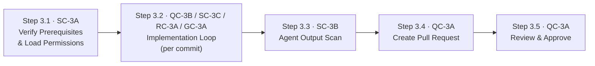

# Stage 3: Coding & Implementation — Process

## Roles

Canonical role definitions: [../roles.yaml](../roles.yaml)

| Role | Short | Stage 3 responsibilities |
| ---- | ----- | ------------------------- |
| Agent | AGT | Writes code; logs decisions (RC-3A); tags provenance (GC-3A); scans output (SC-3B); creates pull request (QC-3A) |
| Developer | DEV | Authors human-written code; reviews pull request; approves; escalation reviewer for high/critical risk tiers |
| Security Architect | SA | Defines and maintains agent permission policy (SC-3A); reviews violation logs; escalation target for SC-3B and SC-3C findings |
| Compliance Officer | CO | Reviews code provenance records and audit artefacts during regulatory audits |

## Input Artifacts

| Artifact | Provided by | Source |
| -------- | ----------- | ------ |
| Approved Design Document | Stage 2 QC-2A | [../02-system-design/artifacts/outputs/design-document.yaml](../02-system-design/artifacts/outputs/design-document.yaml) |
| Directive Injection Confirmation | Stage 2 SC-2B | [../02-system-design/artifacts/outputs/directive-injection-confirmation.yaml](../02-system-design/artifacts/outputs/directive-injection-confirmation.yaml) |

---

## Step Sequence

Step 3.2 is iterative — it repeats on every commit until the implementation is complete. Steps 3.3–3.5 run once after all coding is finished.

---

## Step 3.1 — Verify Prerequisites & Load Permissions

**Control:** [SC-3A](../../controls/sc/SC-3A.yaml) · **Delegation:** Fully automated · **Runs first — blocks all other steps if failed**

| Actor | Action |
| ----- | ------ |
| AGT | Verify that SC-2B directive injection confirmation exists and covers Stage 3 directives |
| AGT | Load agent trust tier and permission policy from SC-3A |
| AGT | Confirm that `directives/stages/03-coding-implementation.yaml` has been acknowledged |
| SA | Confirms permission policy is up to date for the agent trust tier |

| | |
| --- | --- |
| **Input** | Directive injection confirmation (Stage 2 SC-2B output) |
| **Output** | Permission enforcement log started (`artifacts/outputs/permission-enforcement-log.yaml`) |
| **On failure** | Stage 3 cannot begin. Missing directive confirmation or invalid permission policy must be resolved before any coding starts |

---

## Step 3.2 — Implementation Loop

**Controls:** [QC-3B](../../controls/qc/QC-3B.yaml) · [SC-3C](../../controls/sc/SC-3C.yaml) · [RC-3A](../../controls/rc/RC-3A.yaml) · [GC-3A](../../controls/gc/GC-3A.yaml) · **Delegation:** Agent implements, DEV authors · **Runs after:** Step 3.1 · **Repeats on every commit**

This step is the main implementation loop. All four controls run continuously — QC-3B and SC-3C on every commit, GC-3A at the point of generation, RC-3A whenever a significant decision is made.

| Actor | Action |
| ----- | ------ |
| AGT / DEV | Implement code against the approved Stage 2 design document |
| AGT | Tag all agent-generated code with provenance metadata at point of generation (GC-3A → GC-0C registry) |
| AGT / DEV | Commit; QC-3B runs quality gates and SC-3C scans for secrets automatically |
| AGT | Log all significant autonomous decisions to the decision log (RC-3A): rationale, alternatives considered |
| DEV | Review and triage any QC-3B violations or SC-3C blocked commits; resolve before re-committing |
| AGT / DEV | Repeat until all design requirements are implemented |

| | |
| --- | --- |
| **Input** | Approved design document |
| **Outputs** | Quality gate report (`artifacts/outputs/quality-gate-report.yaml`) · Secrets scan report (`artifacts/outputs/secrets-scan-report.yaml`) · Decision log (`artifacts/outputs/decision-log.yaml`) |
| **On QC-3B failure** | Commit blocked; developer resolves violations and re-commits |
| **On SC-3C failure** | Commit blocked; developer removes secret, rotates the credential, and re-commits |
| **On RC-3A gap** | DEV flags missing decision entries to AGT; AGT records retroactively with note |

---

## Step 3.3 — Agent Output Scan

**Control:** [SC-3B](../../controls/sc/SC-3B.yaml) · **Delegation:** Fully automated · **Runs after:** Step 3.2 complete

| Actor | Action |
| ----- | ------ |
| AGT | Trigger SC-3B scan across all agent-generated code in the branch |
| AGT | Report findings: file, line, category, severity |
| SA | Review any flagged findings; determine resolution |
| AGT | Block PR creation if any critical or high findings remain unresolved |

| | |
| --- | --- |
| **Input** | All agent-generated code on the branch |
| **Output** | Post-guardrail scan result (`artifacts/outputs/post-guardrail-scan.yaml`) |
| **On failure** | PR creation is blocked (Step 3.4 cannot begin); SA reviews and remediates findings |

---

## Step 3.4 — Create Pull Request

**Control:** [QC-3A](../../controls/qc/QC-3A.yaml) (creation phase) · **Delegation:** Agent creates · **Runs after:** Step 3.3 passes

| Actor | Action |
| ----- | ------ |
| AGT | Assemble evidence package: all Stage 3 control outputs |
| AGT | Create pull request from feature branch to target branch |
| AGT | Attach all evidence artefacts to the PR |
| AGT | Assign reviewers per risk tier from Stage 1 RC-1A (see table below) |

**Reviewer assignment by risk tier:**

| Risk Tier | Required Reviewers |
| --------- | ------------------ |
| critical | Lead Architect + Security Architect (minimum 2) |
| high | Lead Architect + 1 peer developer (minimum 2) |
| medium | 2 peer developers |
| low | 1 peer developer |

| | |
| --- | --- |
| **Input** | All Stage 3 control outputs |
| **Output** | Pull request record (`artifacts/outputs/pull-request-record.yaml`) — status: open |
| **On failure** | If PR cannot be created (branch conflicts, CI failure), resolve the blocker before retrying |

---

## Step 3.5 — Review & Approve

**Control:** [QC-3A](../../controls/qc/QC-3A.yaml) (review phase) · **Delegation:** Human required · **Runs after:** Step 3.4

| Actor | Action |
| ----- | ------ |
| DEV / LAD | Review code changes against the approved design document |
| DEV / LAD | Review all Stage 3 evidence artefacts (quality gate report, decision log, scan results) |
| DEV / LAD | Request changes or approve; all requested changes must be resolved before re-review |
| DEV / LAD | **Approve:** record identity and timestamp; PR is eligible for merge |
| AGT | Update pull request record with approval details |

| | |
| --- | --- |
| **Input** | Open pull request with full evidence package |
| **Output** | Pull request record (`artifacts/outputs/pull-request-record.yaml`) — status: approved |
| **On changes requested** | Return to Step 3.2 for the specific commits needed; re-run Steps 3.3 and 3.4 |
| **On rejection** | PR closed; document reason; escalate to Lead Architect; remediate and restart from Step 3.2 |

---

## Output Artifacts

| Artifact | Produced at | Control | Template |
| -------- | ----------- | ------- | -------- |
| Permission Enforcement Log | Step 3.1 | SC-3A | [artifacts/outputs/permission-enforcement-log.yaml](artifacts/outputs/permission-enforcement-log.yaml) |
| Quality Gate Report | Step 3.2 (per commit) | QC-3B | [artifacts/outputs/quality-gate-report.yaml](artifacts/outputs/quality-gate-report.yaml) |
| Decision Log | Step 3.2 (continuous) | RC-3A | [artifacts/outputs/decision-log.yaml](artifacts/outputs/decision-log.yaml) |
| Secrets Scan Report | Step 3.2 (per commit) | SC-3C | [artifacts/outputs/secrets-scan-report.yaml](artifacts/outputs/secrets-scan-report.yaml) |
| Post-Guardrail Scan | Step 3.3 | SC-3B | [artifacts/outputs/post-guardrail-scan.yaml](artifacts/outputs/post-guardrail-scan.yaml) |
| Pull Request Record | Step 3.4 / Step 3.5 | QC-3A | [artifacts/outputs/pull-request-record.yaml](artifacts/outputs/pull-request-record.yaml) |
