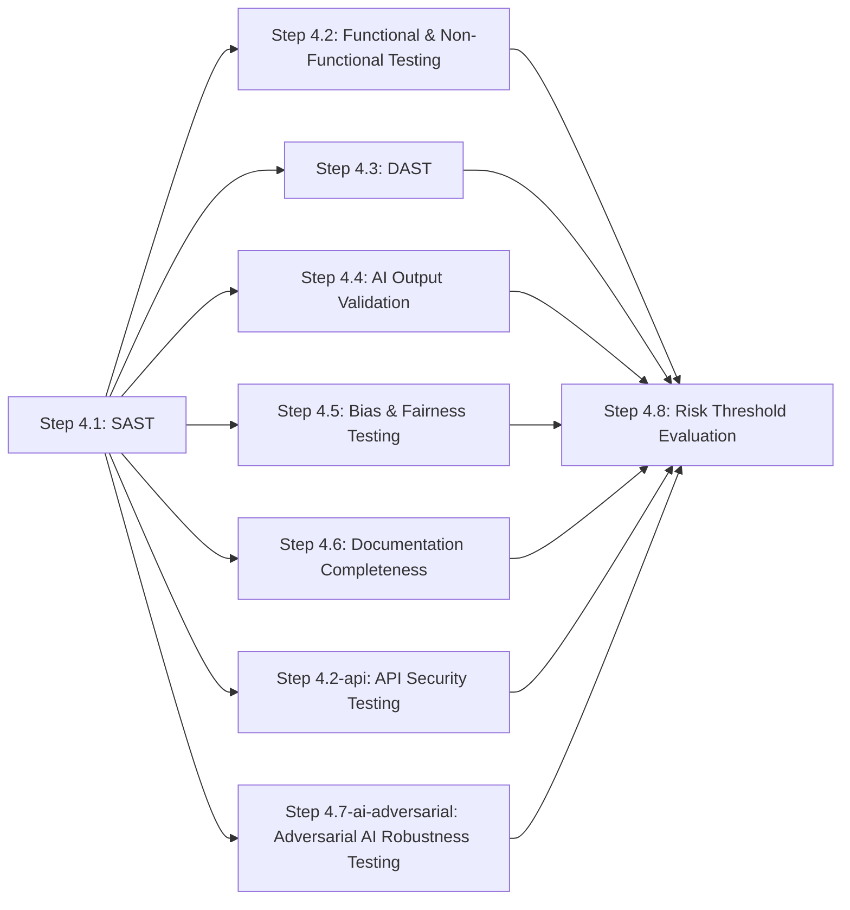

# Stage 4: Testing & Documentation

> **Auto-generated from `stages/04-testing-documentation/04-testing-documentation.yaml`**
>
> Do not edit this file directly. Edit the YAML source and run:
> ```bash
> python3 scripts/generate-docs.py
> ```

Validate the implementation against all acceptance criteria, security requirements, and documentation standards. RC-05 is the formal go/no-go gate for deployment. No change proceeds to Stage 5 without a passing or conditionally accepted RC-05 result.

---

## Overview

| Property | Value |
|----------|-------|
| **Stage** | 4 — Testing & Documentation |
| **Next Stage** | 5 |
| **Controls** | 9 required |
| **File** | [`stages/04-testing-documentation/04-testing-documentation.yaml`](stages/04-testing-documentation/04-testing-documentation.yaml) |

---

## Roles

The following roles participate in this stage:

| Role | Full Name | Responsibilities |
|------|-----------|------------------|
| TENG | Test Engineer | Executes test suites; runs scans; checks documentation completeness; calculates risk threshold; presents evidence |
| QA | QA Engineer | Reviews functional and NFR test results; investigates failures; approves documentation completeness |
| SA | Security Architect | Reviews SAST and DAST findings; triages CWE-mapped vulnerabilities; approves risk acceptance for security findings |
| AGL | AI Governance Lead | Reviews AI output validation and bias test results; approves AI-specific risk acceptance |
| RO | Risk Officer | Makes the formal go/no-go decision at RC-05; provides documented risk acceptance for conditional pass |
| CO | Compliance Officer | Reviews documentation artefacts and test evidence during regulatory audits |

---

## Execution Workflow

The controls in this stage execute in the following order:



### Parallelism

The following steps may run in parallel:

- Step 4.2: Functional & Non-Functional Testing, Step 4.3: DAST, Step 4.4: AI Output Validation, Step 4.5: Bias & Fairness Testing, Step 4.6: Documentation Completeness, Step 4.2-api: API Security Testing, Step 4.7-ai-adversarial: Adversarial AI Robustness Testing

Maximum concurrent steps: **7**

---

## Step-by-Step Process


### Step 4.1 — SAST

**Control:** [`SC-12`](../../controls/sc/SC-12.yaml) · **Delegation:** Fully automated


#### Actors and Actions

| Actor | Action |
|-------|--------|
| AGT | Execute static analysis scan across the full codebase; apply heightened scrutiny to agent-generated code |
| AGT | Map all findings to CWE categories; assign severity ratings |
| SA | Review findings; triage critical and high findings; remediate or document risk acceptance |

#### Inputs and Outputs

| Property | Value |
|----------|-------|
| **Input** | Merged source code from Stage 3 |
| **Output** | SAST scan report (artifacts/outputs/sast-scan-report.yaml) |
| **On Failure** | Critical or high findings block Stage 4 exit until remediated or formally accepted by SA |


### Step 4.2 — Functional & Non-Functional Testing

**Control:** [`QC-06`](../../controls/qc/QC-06.yaml) · **Delegation:** Agent executes, QA reviews


#### Actors and Actions

| Actor | Action |
|-------|--------|
| AGT | Execute functional tests mapped to every Stage 1 acceptance criterion |
| AGT | Execute regression, negative, boundary, performance, load, stress, accessibility, and resilience tests |
| AGT | Produce pass/fail report with each result traced to its originating acceptance criterion |
| QA | Review test results; investigate failures; determine if failures block release or require Stage 3 return |

#### Inputs and Outputs

| Property | Value |
|----------|-------|
| **Input** | Merged code + Stage 1 feature specification (acceptance criteria) |
| **Output** | Test results report (artifacts/outputs/test-results-report.yaml) |
| **On Failure** | Failing acceptance criteria block Stage 4 exit; work returns to Stage 3 for remediation |


### Step 4.3 — DAST

**Control:** [`SC-13`](../../controls/sc/SC-13.yaml) · **Delegation:** Fully automated


#### Actors and Actions

| Actor | Action |
|-------|--------|
| AGT | Execute runtime security test suite against deployed test environment |
| AGT | Test injection attacks, authentication flaws, session management, TLS, OWASP Top 10 categories |
| SA | Review findings; remediate or formally accept residual risk per severity policy |

#### Inputs and Outputs

| Property | Value |
|----------|-------|
| **Input** | Application deployed to test environment |
| **Output** | DAST scan report (artifacts/outputs/dast-scan-report.yaml) |
| **On Failure** | Critical or high runtime findings block Stage 4 exit |


### Step 4.4 — AI Output Validation

**Control:** [`QC-07`](../../controls/qc/QC-07.yaml) · **Delegation:** Agent executes, AGL reviews

**Condition:** Only applicable when the change involves an AI component. If not applicable, document as not_applicable.


#### Actors and Actions

| Actor | Action |
|-------|--------|
| AGT | Execute hallucination detection tests; measure accuracy against defined thresholds |
| AGT | Run output consistency tests across equivalent inputs; execute boundary condition tests |
| AGL | Review AI validation results; determine whether accuracy thresholds are acceptable for release |

#### Inputs and Outputs

| Property | Value |
|----------|-------|
| **Input** | AI component deployed to test environment + AI tier classification from Stage 1 |
| **Output** | AI output validation report (artifacts/outputs/ai-output-validation-report.yaml) |
| **On Failure** | AI systems failing accuracy thresholds cannot proceed to Stage 5 |


### Step 4.5 — Bias & Fairness Testing

**Control:** [`AC-05`](../../controls/ac/AC-05.yaml) · **Delegation:** Agent executes, AGL reviews

**Condition:** Only applicable when the change involves an AI component. If not applicable, document as not_applicable.


#### Actors and Actions

| Actor | Action |
|-------|--------|
| AGT | Execute bias test suite across protected characteristic groups (age, gender, ethnicity, disability) |
| AGT | Measure disparate impact for each group; compare against defined thresholds |
| AGL | Review bias test results; determine if disparate impact is within acceptable thresholds |

#### Inputs and Outputs

| Property | Value |
|----------|-------|
| **Input** | AI component deployed to test environment |
| **Output** | Bias & fairness report (artifacts/outputs/bias-fairness-report.yaml) |
| **On Failure** | Discriminatory outcomes exceeding defined thresholds block deployment; design or training data must be revised |


### Step 4.6 — Documentation Completeness

**Control:** [`QC-08`](../../controls/qc/QC-08.yaml) · **Delegation:** Agent checks, human approves


#### Actors and Actions

| Actor | Action |
|-------|--------|
| AGT | Verify all required documentation exists and is current: runbooks, API docs, ADRs, Stage 3 decision log |
| AGT | For AI components: verify AI Act technical documentation (Annex IV) is complete |
| AGT | Flag any gaps or outdated documentation |
| QA | Review documentation completeness report; approve or require documentation updates |

#### Inputs and Outputs

| Property | Value |
|----------|-------|
| **Input** | All documentation artefacts from the change |
| **Output** | Documentation completeness report (artifacts/outputs/documentation-completeness-report.yaml) |
| **On Failure** | Missing or outdated documentation blocks Stage 4 exit until resolved |


### Step 4.2-api — API Security Testing

**Control:** [`SC-14`](../../controls/sc/SC-14.yaml) · **Delegation:** Fully automated


#### Actors and Actions

| Actor | Action |
|-------|--------|
| AGT | Execute OWASP API Security Top 10 test suite against all exposed APIs |
| SA | Review findings; remediate critical issues or provide risk acceptance |

#### Inputs and Outputs

| Property | Value |
|----------|-------|
| **Input** | Deployed APIs |
| **Output** | API security test report (artifacts/outputs/api-security-report.yaml) |
| **On Failure** | Unresolved OWASP API Top 10 violations block Stage 4 exit |


### Step 4.7-ai-adversarial — Adversarial AI Robustness Testing

**Control:** [`SC-15`](../../controls/sc/SC-15.yaml) · **Delegation:** Fully automated

**Condition:** Only applicable for high-risk or security-critical AI deployments. If not applicable, document as not_applicable.


#### Actors and Actions

| Actor | Action |
|-------|--------|
| AGT | Generate adversarial test inputs to probe AI model robustness |
| SA | Review results; assess susceptibility to adversarial attack |

#### Inputs and Outputs

| Property | Value |
|----------|-------|
| **Input** | AI model + adversarial test suite |
| **Output** | Adversarial robustness report (artifacts/outputs/adversarial-robustness-report.yaml) |
| **Note** | Conditional on high-risk AI deployments |


### Step 4.8 — Risk Threshold Evaluation

**Control:** [`RC-05`](../../controls/rc/RC-05.yaml) · **Delegation:** Agent calculates, RO decides


#### Actors and Actions

| Actor | Action |
|-------|--------|
| AGT | Aggregate all Stage 4 control results; calculate residual risk score |
| AGT | Present recommendation with supporting evidence from each control |
| RO | Review aggregated results; make formal go/no-go decision |
| RO | For conditional pass: provide documented risk acceptance signed with identity and timestamp |

#### Inputs and Outputs

| Property | Value |
|----------|-------|
| **Input** | All Stage 4 control outputs (steps 4.1-4.7) |
| **Output** | Risk threshold evaluation (artifacts/outputs/risk-threshold-evaluation.yaml) |
| **On Failure** | Work returns to Stage 3; specific failures documented; remediation required before retesting |


**Go/No-Go Outcomes**

| Outcome | Meaning | Next step |
| --- | --- | --- |
| Pass | Residual risk within appetite | Proceed to Stage 5 |
| Conditional pass | Residual risk exceeds appetite but is formally accepted | RO documents risk acceptance; proceed to Stage 5 |
| Fail | Residual risk exceeds appetite; cannot be accepted | Return to Stage 3; document specific failures |


---

## Required Controls


### QC-06 — Functional & Non-Functional Testing

- **Track:** QC
- **Delegation:** `agent_executes_human_reviews`
- **File:** [`controls/qc/QC-06.yaml`](../../controls/qc/QC-06.yaml)


### QC-07 — AI Output Validation

- **Track:** QC
- **Delegation:** `agent_executes_human_reviews`
- **File:** [`controls/qc/QC-07.yaml`](../../controls/qc/QC-07.yaml)
- **Note:** Applicable when the change involves an AI component


### QC-08 — Documentation Completeness

- **Track:** QC
- **Delegation:** `agent_checks_human_approves`
- **File:** [`controls/qc/QC-08.yaml`](../../controls/qc/QC-08.yaml)


### SC-12 — SAST

- **Track:** SC
- **Delegation:** `fully_automated`
- **File:** [`controls/sc/SC-12.yaml`](../../controls/sc/SC-12.yaml)


### SC-13 — DAST

- **Track:** SC
- **Delegation:** `fully_automated`
- **File:** [`controls/sc/SC-13.yaml`](../../controls/sc/SC-13.yaml)


### SC-14 — API Security Testing

- **Track:** SC
- **Delegation:** `agent_executes_human_reviews`
- **File:** [`controls/sc/SC-14.yaml`](../../controls/sc/SC-14.yaml)
- **Note:** Test all exposed APIs against OWASP API Security Top 10


### AC-05 — Bias & Fairness Testing

- **Track:** AC
- **Delegation:** `agent_executes_human_reviews`
- **File:** [`controls/ac/AC-05.yaml`](../../controls/ac/AC-05.yaml)
- **Note:** Applicable when the change involves an AI component


### SC-15 — Adversarial AI Robustness Testing

- **Track:** SC
- **Delegation:** `agent_executes_human_reviews`
- **File:** [`controls/sc/SC-15.yaml`](../../controls/sc/SC-15.yaml)
- **Note:** Applicable for high-risk or security-critical AI deployments


### RC-05 — Risk Threshold Evaluation

- **Track:** RC
- **Delegation:** `agent_calculates_human_decides`
- **File:** [`controls/rc/RC-05.yaml`](../../controls/rc/RC-05.yaml)
- **Note:** Final go/no-go gate — depends on all other Stage 4 controls


---

## Input Artifacts

The following artifacts from prior stages are required as inputs:

- [`../01-intent-ingestion/artifacts/outputs/QC-01-feature-spec.yaml`](../01-intent-ingestion/artifacts/outputs/QC-01-feature-spec.yaml)
- [`../01-intent-ingestion/artifacts/outputs/AC-01-ai-tier-classification.yaml`](../01-intent-ingestion/artifacts/outputs/AC-01-ai-tier-classification.yaml)
- [`../03-coding-implementation/artifacts/outputs/QC-04-pull-request-record.yaml`](../03-coding-implementation/artifacts/outputs/QC-04-pull-request-record.yaml)

---

## Output Artifacts

This stage produces the following artifacts:

- [`artifacts/outputs/QC-06-test-results-report.yaml`](artifacts/outputs/QC-06-test-results-report.yaml)
- [`artifacts/outputs/SC-12-sast-scan-report.yaml`](artifacts/outputs/SC-12-sast-scan-report.yaml)
- [`artifacts/outputs/SC-13-dast-scan-report.yaml`](artifacts/outputs/SC-13-dast-scan-report.yaml)
- [`artifacts/outputs/QC-08-documentation-completeness-report.yaml`](artifacts/outputs/QC-08-documentation-completeness-report.yaml)
- [`artifacts/outputs/QC-07-ai-output-validation-report.yaml`](artifacts/outputs/QC-07-ai-output-validation-report.yaml)
- [`artifacts/outputs/AC-05-bias-fairness-report.yaml`](artifacts/outputs/AC-05-bias-fairness-report.yaml)
- [`artifacts/outputs/RC-05-risk-threshold-evaluation.yaml`](artifacts/outputs/RC-05-risk-threshold-evaluation.yaml)
- [`artifacts/outputs/SC-14-api-security-report.yaml`](artifacts/outputs/SC-14-api-security-report.yaml)
- [`artifacts/outputs/SC-15-adversarial-robustness-report.yaml`](artifacts/outputs/SC-15-adversarial-robustness-report.yaml)

---


**Last Updated:** 2026-03-09 21:43 UTC