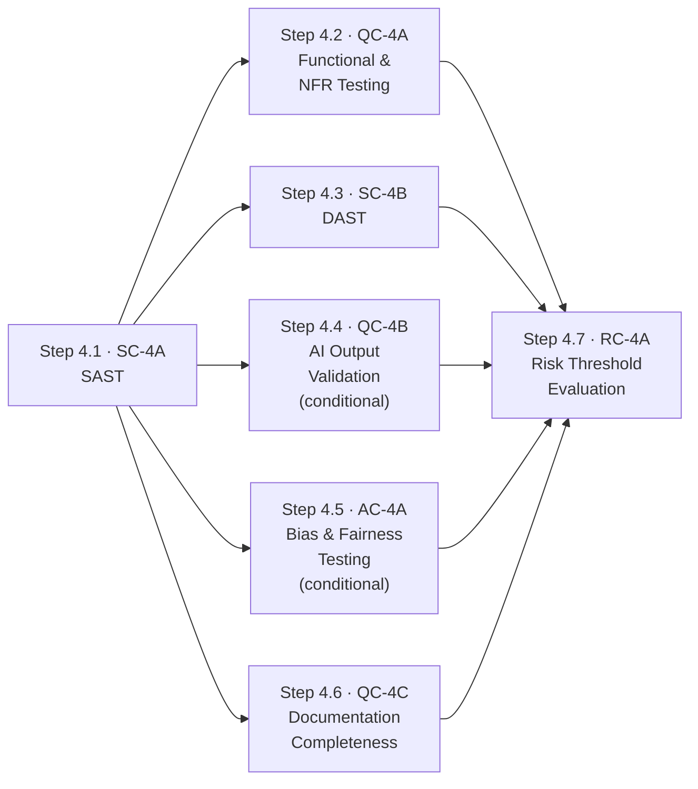

# Stage 4: Testing & Documentation — Process

## Roles

Canonical role definitions: [../roles.yaml](../roles.yaml)

| Role | Short | Stage 4 responsibilities |
| ---- | ----- | ------------------------- |
| Agent | AGT | Executes test suites; runs scans; checks documentation completeness; calculates risk threshold; presents evidence |
| QA Engineer | QA | Reviews functional and NFR test results; investigates failures; approves documentation completeness |
| Security Architect | SA | Reviews SAST and DAST findings; triages CWE-mapped vulnerabilities; approves risk acceptance for security findings |
| AI Governance Lead | AGL | Reviews AI output validation and bias test results; approves AI-specific risk acceptance |
| Risk Officer | RO | Makes the formal go/no-go decision at RC-4A; provides documented risk acceptance for conditional pass |
| Compliance Officer | CO | Reviews documentation artefacts and test evidence during regulatory audits |

## Input Artifacts

| Artifact | Provided by | Source |
| -------- | ----------- | ------ |
| Approved Feature Specification | Stage 1 QC-1A | [../01-intent-ingestion/artifacts/outputs/feature-spec.yaml](../01-intent-ingestion/artifacts/outputs/feature-spec.yaml) |
| AI Tier Classification | Stage 1 AC-1A | [../01-intent-ingestion/artifacts/outputs/ai-tier-classification.yaml](../01-intent-ingestion/artifacts/outputs/ai-tier-classification.yaml) |
| Approved Pull Request | Stage 3 QC-3A | [../03-coding-implementation/artifacts/outputs/pull-request-record.yaml](../03-coding-implementation/artifacts/outputs/pull-request-record.yaml) |

---

## Step Sequence

Step 4.1 runs first on the merged source. Steps 4.2–4.6 run in parallel once the test environment is ready. Step 4.7 runs only after all of 4.1–4.6 complete.

---

## Step 4.1 — SAST

**Control:** [SC-4A](../../controls/sc/SC-4A.yaml) · **Delegation:** Fully automated · **Runs first on merged code**

| Actor | Action |
| ----- | ------ |
| AGT | Execute static analysis scan across the full codebase; apply heightened scrutiny to agent-generated code |
| AGT | Map all findings to CWE categories; assign severity ratings |
| SA | Review findings; triage critical and high findings; remediate or document risk acceptance |

| | |
| --- | --- |
| **Input** | Merged source code from Stage 3 |
| **Output** | SAST scan report (`artifacts/outputs/sast-scan-report.yaml`) |
| **On failure** | Critical or high findings block Stage 4 exit until remediated or formally accepted by SA |

---

## Steps 4.2, 4.3, 4.4, 4.5, 4.6 — Run in parallel after Step 4.1

---

## Step 4.2 — Functional & Non-Functional Testing

**Control:** [QC-4A](../../controls/qc/QC-4A.yaml) · **Delegation:** Agent executes, QA reviews · **Parallel with:** Steps 4.3, 4.4, 4.5, 4.6

| Actor | Action |
| ----- | ------ |
| AGT | Execute functional tests mapped to every Stage 1 acceptance criterion |
| AGT | Execute regression, negative, boundary, performance, load, stress, accessibility, and resilience tests |
| AGT | Produce pass/fail report with each result traced to its originating acceptance criterion |
| QA | Review test results; investigate failures; determine if failures block release or require Stage 3 return |

| | |
| --- | --- |
| **Input** | Merged code + Stage 1 feature specification (acceptance criteria) |
| **Output** | Test results report (`artifacts/outputs/test-results-report.yaml`) |
| **On failure** | Failing acceptance criteria block Stage 4 exit; work returns to Stage 3 for remediation |

---

## Step 4.3 — DAST

**Control:** [SC-4B](../../controls/sc/SC-4B.yaml) · **Delegation:** Fully automated · **Parallel with:** Steps 4.2, 4.4, 4.5, 4.6

| Actor | Action |
| ----- | ------ |
| AGT | Execute runtime security test suite against deployed test environment |
| AGT | Test injection attacks, authentication flaws, session management, TLS, OWASP Top 10 categories |
| SA | Review findings; remediate or formally accept residual risk per severity policy |

| | |
| --- | --- |
| **Input** | Application deployed to test environment |
| **Output** | DAST scan report (`artifacts/outputs/dast-scan-report.yaml`) |
| **On failure** | Critical or high runtime findings block Stage 4 exit |

---

## Step 4.4 — AI Output Validation *(conditional)*

**Control:** [QC-4B](../../controls/qc/QC-4B.yaml) · **Delegation:** Agent executes, AGL reviews · **Parallel with:** Steps 4.2, 4.3, 4.5, 4.6

**Condition:** Only applicable when the change involves an AI component. If not applicable, document as `not_applicable`.

| Actor | Action |
| ----- | ------ |
| AGT | Execute hallucination detection tests; measure accuracy against defined thresholds |
| AGT | Run output consistency tests across equivalent inputs; execute boundary condition tests |
| AGL | Review AI validation results; determine whether accuracy thresholds are acceptable for release |

| | |
| --- | --- |
| **Input** | AI component deployed to test environment + AI tier classification from Stage 1 |
| **Output** | AI output validation report (`artifacts/outputs/ai-output-validation-report.yaml`) |
| **On failure** | AI systems failing accuracy thresholds cannot proceed to Stage 5 |

---

## Step 4.5 — Bias & Fairness Testing *(conditional)*

**Control:** [AC-4A](../../controls/ac/AC-4A.yaml) · **Delegation:** Agent executes, AGL reviews · **Parallel with:** Steps 4.2, 4.3, 4.4, 4.6

**Condition:** Only applicable when the change involves an AI component. If not applicable, document as `not_applicable`.

| Actor | Action |
| ----- | ------ |
| AGT | Execute bias test suite across protected characteristic groups (age, gender, ethnicity, disability) |
| AGT | Measure disparate impact for each group; compare against defined thresholds |
| AGL | Review bias test results; determine if disparate impact is within acceptable thresholds |

| | |
| --- | --- |
| **Input** | AI component deployed to test environment |
| **Output** | Bias & fairness report (`artifacts/outputs/bias-fairness-report.yaml`) |
| **On failure** | Discriminatory outcomes exceeding defined thresholds block deployment; design or training data must be revised |

---

## Step 4.6 — Documentation Completeness

**Control:** [QC-4C](../../controls/qc/QC-4C.yaml) · **Delegation:** Agent checks, human approves · **Parallel with:** Steps 4.2, 4.3, 4.4, 4.5

| Actor | Action |
| ----- | ------ |
| AGT | Verify all required documentation exists and is current: runbooks, API docs, ADRs, Stage 3 decision log |
| AGT | For AI components: verify AI Act technical documentation (Annex IV) is complete |
| AGT | Flag any gaps or outdated documentation |
| QA | Review documentation completeness report; approve or require documentation updates |

| | |
| --- | --- |
| **Input** | All documentation artefacts from the change |
| **Output** | Documentation completeness report (`artifacts/outputs/documentation-completeness-report.yaml`) |
| **On failure** | Missing or outdated documentation blocks Stage 4 exit until resolved |

---

## Step 4.7 — Risk Threshold Evaluation

**Control:** [RC-4A](../../controls/rc/RC-4A.yaml) · **Delegation:** Agent calculates, RO decides · **Runs after:** Steps 4.1–4.6 all complete

**Outcomes:**

| Outcome | Meaning | Next step |
| ------- | ------- | --------- |
| Pass | Residual risk within appetite | Proceed to Stage 5 |
| Conditional pass | Residual risk exceeds appetite but is formally accepted | RO documents risk acceptance; proceed to Stage 5 |
| Fail | Residual risk exceeds appetite; cannot be accepted | Return to Stage 3; document specific failures |

| Actor | Action |
| ----- | ------ |
| AGT | Aggregate all Stage 4 control results; calculate residual risk score |
| AGT | Present recommendation with supporting evidence from each control |
| RO | Review aggregated results; make formal go/no-go decision |
| RO | For conditional pass: provide documented risk acceptance signed with identity and timestamp |

| | |
| --- | --- |
| **Input** | All Stage 4 control outputs (steps 4.1–4.6) |
| **Output** | Risk threshold evaluation (`artifacts/outputs/risk-threshold-evaluation.yaml`) |
| **On fail** | Work returns to Stage 3; specific failures documented; remediation required before retesting |

---

## Output Artifacts

| Artifact | Produced at | Control | Template |
| -------- | ----------- | ------- | -------- |
| SAST Scan Report | Step 4.1 | SC-4A | [artifacts/outputs/sast-scan-report.yaml](artifacts/outputs/sast-scan-report.yaml) |
| Test Results Report | Step 4.2 | QC-4A | [artifacts/outputs/test-results-report.yaml](artifacts/outputs/test-results-report.yaml) |
| DAST Scan Report | Step 4.3 | SC-4B | [artifacts/outputs/dast-scan-report.yaml](artifacts/outputs/dast-scan-report.yaml) |
| AI Output Validation Report | Step 4.4 | QC-4B | [artifacts/outputs/ai-output-validation-report.yaml](artifacts/outputs/ai-output-validation-report.yaml) |
| Bias & Fairness Report | Step 4.5 | AC-4A | [artifacts/outputs/bias-fairness-report.yaml](artifacts/outputs/bias-fairness-report.yaml) |
| Documentation Completeness Report | Step 4.6 | QC-4C | [artifacts/outputs/documentation-completeness-report.yaml](artifacts/outputs/documentation-completeness-report.yaml) |
| Risk Threshold Evaluation | Step 4.7 | RC-4A | [artifacts/outputs/risk-threshold-evaluation.yaml](artifacts/outputs/risk-threshold-evaluation.yaml) |
