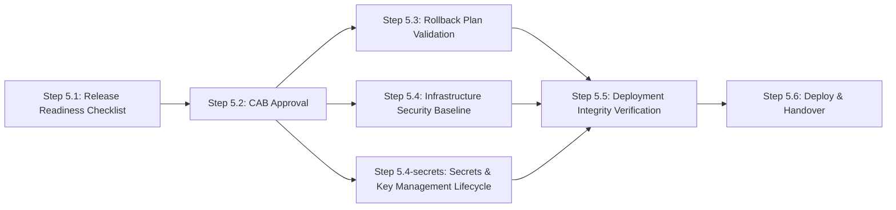

# Stage 5: Deployment & Release

> **Auto-generated from `stages/05-deployment-release/05-deployment-release.yaml`**
>
> Do not edit this file directly. Edit the YAML source and run:
> ```bash
> python3 scripts/generate-docs.py
> ```

Execute the approved deployment with formal CAB sign-off, verified rollback procedures, and cryptographic artefact integrity checking. RC-5A CAB Approval is a mandatory human gate that cannot be delegated.

---

## Overview

| Property | Value |
|----------|-------|
| **Stage** | 5 — Deployment & Release |
| **Next Stage** | 6 |
| **Controls** | 7 required |
| **File** | [`stages/05-deployment-release/05-deployment-release.yaml`](stages/05-deployment-release/05-deployment-release.yaml) |

---

## Roles

The following roles participate in this stage:

| Role | Full Name | Responsibilities |
|------|-----------|------------------|
| AGT | Agent | Compiles release readiness checklist; prepares CAB submission; validates rollback; runs infrastructure and integrity checks |
| REL | Release Manager | Reviews and approves release readiness checklist and rollback plan; orchestrates deployment execution |
| RO | Risk Officer | Makes the formal CAB approval decision for high-risk changes |
| SA | Security Architect | Reviews infrastructure security baseline deviations; investigates deployment integrity failures |
| OPS | Operations / SRE | Executes deployment pipeline; monitors smoke tests; manages hypercare window; confirms Stage 6 handover |
| CO | Compliance Officer | Reviews approval records during regulatory audits |

---

## Execution Workflow

The controls in this stage execute in the following order:



### Parallelism

The following steps may run in parallel:

- Step 5.3: Rollback Plan Validation, Step 5.4: Infrastructure Security Baseline, Step 5.4-secrets: Secrets & Key Management Lifecycle

Maximum concurrent steps: **3**

---

## Step-by-Step Process


### Step 5.1 — Release Readiness Checklist

**Control:** [`QC-5A`](../../controls/qc/QC-5A.yaml) · **Delegation:** Agent compiles, REL approves


#### Actors and Actions

| Actor | Action |
|-------|--------|
| AGT | Query audit trail (GC-0A) to confirm all prior stage controls were executed and passed |
| AGT | Confirm Stage 4 RC-4A result is pass or approved conditional pass |
| AGT | Verify documentation is current and release package is complete |
| AGT | Flag any gaps in control evidence |
| REL | Review completed checklist; approve release package or require resolution of gaps |

#### Inputs and Outputs

| Property | Value |
|----------|-------|
| **Input** | Audit trail (GC-0A) + Stage 4 risk threshold evaluation (RC-4A output) |
| **Output** | Release readiness checklist (artifacts/outputs/release-readiness-checklist.yaml) |
| **On Failure** | Gaps in prior control evidence block the release; must be resolved before seeking CAB approval |


### Step 5.2 — CAB Approval

**Control:** [`RC-5A`](../../controls/rc/RC-5A.yaml) · **Delegation:** Human required


#### Actors and Actions

| Actor | Action |
|-------|--------|
| AGT | Prepare change approval request with full release readiness package; schedule CAB slot if required |
| RO | Review the full evidence package and make the formal approval decision |
| RO | Approve: record identity, role, and timestamp; advance to Steps 5.3 and 5.4 |
| RO | Reject: document rejection reason; work may return to any required stage |

#### Inputs and Outputs

| Property | Value |
|----------|-------|
| **Input** | Release readiness checklist (Step 5.1 output) + Stage 1 risk classification |
| **Output** | Change approval record (artifacts/outputs/change-approval-record.yaml) |
| **On Failure** | Deployment blocked; rejection reason documented; escalate to determine required remediation |


**Approval authority by risk tier**

| Risk Tier | Required Approval Authority |
| --- | --- |
| critical | Change Advisory Board (full CAB) |
| high | Change Advisory Board (full CAB) |
| medium | Line management |
| low | Pre-approved standard change procedure |


### Step 5.3 — Rollback Plan Validation

**Control:** [`RC-5B`](../../controls/rc/RC-5B.yaml) · **Delegation:** Agent validates, REL approves


#### Actors and Actions

| Actor | Action |
|-------|--------|
| AGT | Validate rollback plan completeness: triggers, procedure steps, decision authority, time window |
| AGT | Execute rollback procedure test in pre-production environment; record execution time |
| AGT | Report test results |
| REL | Review rollback test results; approve plan or require improvements before deployment |

#### Inputs and Outputs

| Property | Value |
|----------|-------|
| **Input** | Rollback plan draft + pre-production environment access |
| **Output** | Rollback plan validation report (artifacts/outputs/rollback-plan.yaml) |
| **On Failure** | Deployment blocked if rollback cannot be validated in pre-production |


### Step 5.4 — Infrastructure Security Baseline

**Control:** [`SC-5A`](../../controls/sc/SC-5A.yaml) · **Delegation:** Fully automated


#### Actors and Actions

| Actor | Action |
|-------|--------|
| AGT | Scan production environment configuration against approved security baseline |
| AGT | Check: patching status, access control configurations, network segmentation, IaC compliance, configuration drift |
| SA | Review any deviations; resolve before deployment or provide documented risk acceptance |

#### Inputs and Outputs

| Property | Value |
|----------|-------|
| **Input** | Production environment + approved security baseline configuration |
| **Output** | Infrastructure security baseline report (artifacts/outputs/infrastructure-security-report.yaml) |
| **On Failure** | Deviations block deployment until resolved or formally accepted by SA |


### Step 5.4-secrets — Secrets & Key Management Lifecycle

**Control:** [`SC-5C`](../../controls/sc/SC-5C.yaml) · **Delegation:** Fully automated


#### Actors and Actions

| Actor | Action |
|-------|--------|
| AGT | Verify all secrets and encryption keys for the deployment are properly vaulted and accessible |
| AGT | Validate key rotation schedules and access control policies |
| SA | Review vaulting configuration; approve or require remediation |

#### Inputs and Outputs

| Property | Value |
|----------|-------|
| **Input** | Deployment configuration + secret vault configuration |
| **Output** | Secrets management validation report (artifacts/outputs/secrets-management-report.yaml) |
| **On Failure** | Deployment blocked if secrets are not properly vaulted or access-controlled |


### Step 5.5 — Deployment Integrity Verification

**Control:** [`SC-5B`](../../controls/sc/SC-5B.yaml) · **Delegation:** Fully automated


#### Actors and Actions

| Actor | Action |
|-------|--------|
| AGT | Compute cryptographic checksums of artefacts staged for production deployment |
| AGT | Compare against checksums of artefacts tested in Stage 4 |
| AGT | Match: record verification and advance to Step 5.6 |
| AGT | Mismatch: block deployment immediately; notify SA; initiate security incident process |

#### Inputs and Outputs

| Property | Value |
|----------|-------|
| **Input** | Staged deployment artefacts + Stage 4 tested artefact checksums |
| **Output** | Deployment integrity verification record (artifacts/outputs/deployment-integrity-record.yaml) |
| **On Failure** | Deployment immediately blocked; security incident process initiated; SA investigates before any retry |
| **Note** | This check runs immediately before deployment execution. Any integrity failure halts the deployment and initiates a security incident process. |


### Step 5.6 — Deploy & Handover

**No control** (procedural step) · **Delegation:** Agent executes pipeline, OPS confirms


#### Actors and Actions

| Actor | Action |
|-------|--------|
| AGT | Execute deployment via approved pipeline |
| OPS | Execute smoke tests against production |
| OPS | Confirm service health and enter hypercare window |
| OPS | Activate Stage 6 monitoring profile |
| OPS | Confirm Stage 6 handover; record handover timestamp |

#### Inputs and Outputs

| Property | Value |
|----------|-------|
| **Input** | Verified deployment artefacts (Step 5.5 output) |
| **Output** | Handover confirmation recorded in deployment integrity record |
| **On Failure** | Initiate rollback per validated rollback plan (Step 5.3 output); do not remain in partial deployment state |


---

## Required Controls


### QC-5A — Release Readiness Checklist

- **Track:** QC
- **Delegation:** `agent_compiles_human_approves`
- **File:** [`controls/qc/QC-5A.yaml`](../../controls/qc/QC-5A.yaml)


### RC-5A — CAB Approval

- **Track:** RC
- **Delegation:** `human_required`
- **File:** [`controls/rc/RC-5A.yaml`](../../controls/rc/RC-5A.yaml)
- **Note:** Human-required gate — cannot be delegated to an agent


### RC-5B — Rollback Plan Validation

- **Track:** RC
- **Delegation:** `agent_validates_human_approves`
- **File:** [`controls/rc/RC-5B.yaml`](../../controls/rc/RC-5B.yaml)


### SC-5A — Infrastructure Security

- **Track:** SC
- **Delegation:** `fully_automated`
- **File:** [`controls/sc/SC-5A.yaml`](../../controls/sc/SC-5A.yaml)


### SC-5B — Deployment Integrity

- **Track:** SC
- **Delegation:** `fully_automated`
- **File:** [`controls/sc/SC-5B.yaml`](../../controls/sc/SC-5B.yaml)
- **Note:** Must run immediately before deployment execution


### SC-5C — Secrets & Key Management Lifecycle

- **Track:** SC
- **Delegation:** `agent_checks_human_approves`
- **File:** [`controls/sc/SC-5C.yaml`](../../controls/sc/SC-5C.yaml)
- **Note:** Verify all secrets and keys are properly vaulted, rotated, and access-controlled


### AC-2B — AI Model Governance & Version Control

- **Track:** AC
- **Delegation:** `agent_creates_human_reviews`
- **File:** [`controls/ac/AC-2B.yaml`](../../controls/ac/AC-2B.yaml)
- **Note:** Applicable when change involves AI models — verify deployed model version matches registry


---

## Input Artifacts

The following artifacts from prior stages are required as inputs:

- [`../04-testing-documentation/artifacts/outputs/RC-4A-risk-threshold-evaluation.yaml`](../04-testing-documentation/artifacts/outputs/RC-4A-risk-threshold-evaluation.yaml)
- [`../03-coding-implementation/artifacts/outputs/QC-3A-pull-request-record.yaml`](../03-coding-implementation/artifacts/outputs/QC-3A-pull-request-record.yaml)

---

## Output Artifacts

This stage produces the following artifacts:

- [`artifacts/outputs/QC-5A-release-readiness-checklist.yaml`](artifacts/outputs/QC-5A-release-readiness-checklist.yaml)
- [`artifacts/outputs/RC-5A-change-approval-record.yaml`](artifacts/outputs/RC-5A-change-approval-record.yaml)
- [`artifacts/outputs/RC-5B-rollback-plan.yaml`](artifacts/outputs/RC-5B-rollback-plan.yaml)
- [`artifacts/outputs/SC-5A-infrastructure-security-report.yaml`](artifacts/outputs/SC-5A-infrastructure-security-report.yaml)
- [`artifacts/outputs/SC-5B-deployment-integrity-record.yaml`](artifacts/outputs/SC-5B-deployment-integrity-record.yaml)
- [`artifacts/outputs/SC-5C-secrets-management-report.yaml`](artifacts/outputs/SC-5C-secrets-management-report.yaml)

---


**Last Updated:** 2026-03-06 07:42 UTC