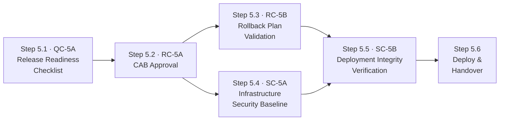

# Stage 5: Deployment & Release — Process

## Roles

Canonical role definitions: [../roles.yaml](../roles.yaml)

| Role | Short | Stage 5 responsibilities |
| ---- | ----- | ------------------------- |
| Agent | AGT | Compiles release readiness checklist; prepares CAB submission; validates rollback; runs infrastructure and integrity checks |
| Release Manager | REL | Reviews and approves release readiness checklist and rollback plan; orchestrates deployment execution |
| Risk Officer | RO | Makes the formal CAB approval decision for high-risk changes |
| Security Architect | SA | Reviews infrastructure security baseline deviations; investigates deployment integrity failures |
| Operations / SRE | OPS | Executes deployment pipeline; monitors smoke tests; manages hypercare window; confirms Stage 6 handover |
| Compliance Officer | CO | Reviews approval records during regulatory audits |

## Input Artifacts

| Artifact | Provided by | Source |
| -------- | ----------- | ------ |
| Risk Threshold Evaluation | Stage 4 RC-4A | [../04-testing-documentation/artifacts/outputs/risk-threshold-evaluation.yaml](../04-testing-documentation/artifacts/outputs/risk-threshold-evaluation.yaml) |
| Approved Pull Request | Stage 3 QC-3A | [../03-coding-implementation/artifacts/outputs/pull-request-record.yaml](../03-coding-implementation/artifacts/outputs/pull-request-record.yaml) |

---

## Step Sequence

Step 5.1 compiles the release package. Step 5.2 (CAB) is the human gate. Steps 5.3 and 5.4 run in parallel after approval. Step 5.5 is the final automated check immediately before deploy. Step 5.6 executes the deployment.

---

## Step 5.1 — Release Readiness Checklist

**Control:** [QC-5A](../../controls/qc/QC-5A.yaml) · **Delegation:** Agent compiles, REL approves · **Runs first — blocks all other steps if gaps found**

| Actor | Action |
| ----- | ------ |
| AGT | Query audit trail (GC-0A) to confirm all prior stage controls were executed and passed |
| AGT | Confirm Stage 4 RC-4A result is pass or approved conditional pass |
| AGT | Verify documentation is current and release package is complete |
| AGT | Flag any gaps in control evidence |
| REL | Review completed checklist; approve release package or require resolution of gaps |

| | |
| --- | --- |
| **Input** | Audit trail (GC-0A) + Stage 4 risk threshold evaluation (RC-4A output) |
| **Output** | Release readiness checklist (`artifacts/outputs/release-readiness-checklist.yaml`) |
| **On failure** | Gaps in prior control evidence block the release; must be resolved before seeking CAB approval |

---

## Step 5.2 — CAB Approval

**Control:** [RC-5A](../../controls/rc/RC-5A.yaml) · **Delegation:** Human required · **Runs after:** Step 5.1

**This control cannot be delegated to an agent under any circumstances.**

**Approval authority by risk tier:**

| Risk Tier | Required Approval Authority |
| --------- | --------------------------- |
| critical | Change Advisory Board (full CAB) |
| high | Change Advisory Board (full CAB) |
| medium | Line management |
| low | Pre-approved standard change procedure |

| Actor | Action |
| ----- | ------ |
| AGT | Prepare change approval request with full release readiness package; schedule CAB slot if required |
| RO / CAB | Review the full evidence package and make the formal approval decision |
| RO / CAB | **Approve:** record identity, role, and timestamp; advance to Steps 5.3 and 5.4 |
| RO / CAB | **Reject:** document rejection reason; work may return to any required stage |

| | |
| --- | --- |
| **Input** | Release readiness checklist (Step 5.1 output) + Stage 1 risk classification |
| **Output** | Change approval record (`artifacts/outputs/change-approval-record.yaml`) |
| **On rejection** | Deployment blocked; rejection reason documented; escalate to determine required remediation |

---

## Steps 5.3 and 5.4 — Run in parallel after Step 5.2

---

## Step 5.3 — Rollback Plan Validation

**Control:** [RC-5B](../../controls/rc/RC-5B.yaml) · **Delegation:** Agent validates, REL approves · **Parallel with:** Step 5.4 · **Runs after:** Step 5.2

| Actor | Action |
| ----- | ------ |
| AGT | Validate rollback plan completeness: triggers, procedure steps, decision authority, time window |
| AGT | Execute rollback procedure test in pre-production environment; record execution time |
| AGT | Report test results |
| REL | Review rollback test results; approve plan or require improvements before deployment |

| | |
| --- | --- |
| **Input** | Rollback plan draft + pre-production environment access |
| **Output** | Rollback plan validation report (`artifacts/outputs/rollback-plan.yaml`) |
| **On failure** | Deployment blocked if rollback cannot be validated in pre-production |

---

## Step 5.4 — Infrastructure Security Baseline

**Control:** [SC-5A](../../controls/sc/SC-5A.yaml) · **Delegation:** Fully automated · **Parallel with:** Step 5.3 · **Runs after:** Step 5.2

| Actor | Action |
| ----- | ------ |
| AGT | Scan production environment configuration against approved security baseline |
| AGT | Check: patching status, access control configurations, network segmentation, IaC compliance, configuration drift |
| SA | Review any deviations; resolve before deployment or provide documented risk acceptance |

| | |
| --- | --- |
| **Input** | Production environment + approved security baseline configuration |
| **Output** | Infrastructure security baseline report (`artifacts/outputs/infrastructure-security-report.yaml`) |
| **On failure** | Deviations block deployment until resolved or formally accepted by SA |

---

## Step 5.5 — Deployment Integrity Verification

**Control:** [SC-5B](../../controls/sc/SC-5B.yaml) · **Delegation:** Fully automated · **Runs after:** Steps 5.3 and 5.4

This check runs **immediately before deployment execution**. Any integrity failure halts the deployment and initiates a security incident process.

| Actor | Action |
| ----- | ------ |
| AGT | Compute cryptographic checksums of artefacts staged for production deployment |
| AGT | Compare against checksums of artefacts tested in Stage 4 |
| AGT | **Match:** record verification and advance to Step 5.6 |
| AGT | **Mismatch:** block deployment immediately; notify SA; initiate security incident process |

| | |
| --- | --- |
| **Input** | Staged deployment artefacts + Stage 4 tested artefact checksums |
| **Output** | Deployment integrity verification record (`artifacts/outputs/deployment-integrity-record.yaml`) |
| **On mismatch** | Deployment immediately blocked; security incident process initiated; SA investigates before any retry |

---

## Step 5.6 — Deploy & Handover

**Delegation:** Agent executes pipeline, OPS confirms · **Runs after:** Step 5.5 passes

| Actor | Action |
| ----- | ------ |
| AGT / OPS | Execute deployment via approved pipeline |
| OPS | Execute smoke tests against production |
| OPS | Confirm service health and enter hypercare window |
| OPS | Activate Stage 6 monitoring profile |
| OPS | Confirm Stage 6 handover; record handover timestamp |

| | |
| --- | --- |
| **Input** | Verified deployment artefacts (Step 5.5 output) |
| **Output** | Handover confirmation recorded in deployment integrity record |
| **On smoke test failure** | Initiate rollback per validated rollback plan (Step 5.3 output); do not remain in partial deployment state |

---

## Output Artifacts

| Artifact | Produced at | Control | Template |
| -------- | ----------- | ------- | -------- |
| Release Readiness Checklist | Step 5.1 | QC-5A | [artifacts/outputs/release-readiness-checklist.yaml](artifacts/outputs/release-readiness-checklist.yaml) |
| Change Approval Record | Step 5.2 | RC-5A | [artifacts/outputs/change-approval-record.yaml](artifacts/outputs/change-approval-record.yaml) |
| Rollback Plan | Step 5.3 | RC-5B | [artifacts/outputs/rollback-plan.yaml](artifacts/outputs/rollback-plan.yaml) |
| Infrastructure Security Report | Step 5.4 | SC-5A | [artifacts/outputs/infrastructure-security-report.yaml](artifacts/outputs/infrastructure-security-report.yaml) |
| Deployment Integrity Record | Step 5.5 / 5.6 | SC-5B | [artifacts/outputs/deployment-integrity-record.yaml](artifacts/outputs/deployment-integrity-record.yaml) |
