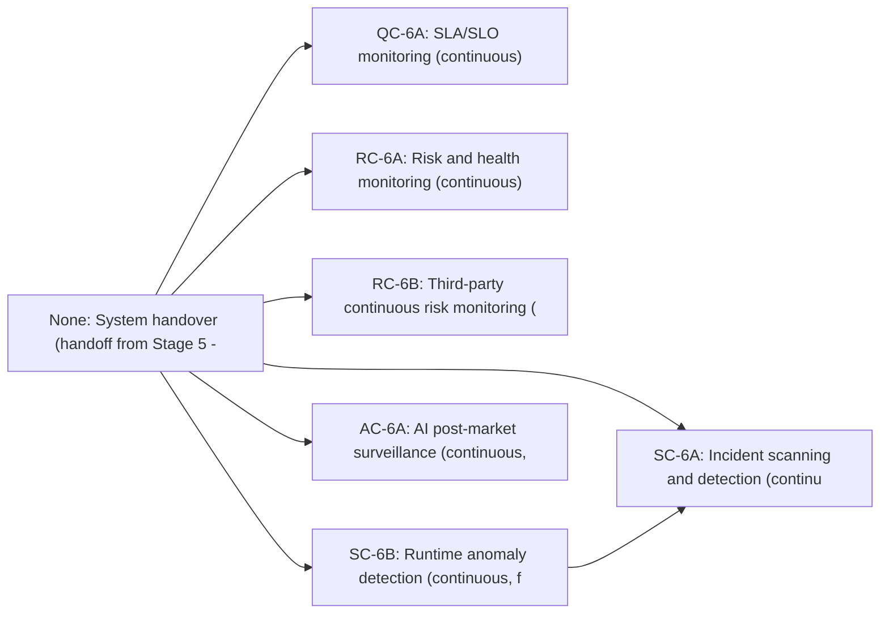

# Stage 6: Observability & Maintenance

> **Auto-generated from `stages/06-observability-maintenance/06-observability-maintenance.yaml`**
>
> Do not edit this file directly. Edit the YAML source and run:
> ```bash
> python3 scripts/generate-docs.py
> ```

Operate, monitor, and maintain the deployed system. Controls in this stage run continuously, not per-change. Escalations from Stage 6 controls may trigger feedback loops back into earlier stages for remediation.

---

## Overview

| Property | Value |
|----------|-------|
| **Stage** | 6 — Observability & Maintenance |
| **Next Stage** | End of lifecycle |
| **Controls** | 6 required |
| **File** | [`stages/06-observability-maintenance/06-observability-maintenance.yaml`](stages/06-observability-maintenance/06-observability-maintenance.yaml) |

---

## Roles

The following roles participate in this stage:

| Role | Full Name | Responsibilities |
|------|-----------|------------------|
| AGT | Agent | Executes continuous monitoring; detects anomalies; classifies incidents; prepares regulatory reports; triggers alerts |
| OPS | Operations / SRE | Activates monitoring at handover; responds to SLO and health alerts; initiates feedback loops for code changes |
| SA | Security Architect | Responds to incident and anomaly escalations; approves DORA Art. 19 classification; investigates security events |
| RO | Risk Officer | Responds to risk escalations from RC-6A; makes risk acceptance decisions; approves feedback loop triggers |
| AGL | AI Governance Lead | Reviews AI post-market surveillance results; files serious AI incident reports per Art. 73 |
| CO | Compliance Officer | Reviews all regulatory incident reports; ensures DORA and AI Act reporting obligations are met |

---

## Execution Workflow

The controls in this stage execute in the following order:



### Parallelism

The following controls may run in parallel:

- n-qc6a, n-rc6a, n-rc6b, n-sc6a, n-sc6b, n-ac6a

Maximum concurrent controls: **6**

---

## Step-by-Step Process


### Step 6.1 — Activate Monitoring

**No control** (procedural step) · **Delegation:** Fully automated


#### Actors and Actions

| Actor | Action |
|-------|--------|
| OPS | Confirm Stage 5 deployment integrity record is present and status is verified |
| AGT | Activate all monitoring profiles — SLO dashboards, health checks, SIEM rules, anomaly baselines |
| AGT | Confirm all monitoring channels are emitting data; alert on any silent channel |
| OPS | Confirm monitoring activation and enter hypercare window |

#### Inputs and Outputs

| Property | Value |
|----------|-------|
| **Input** | Deployment integrity record (Stage 5 SC-5B output) |
| **Output** | Monitoring activation confirmed; all Stage 6 controls enter continuous operation |
| **On Failure** | If any monitoring channel fails to activate, do not leave Stage 5 hypercare. Resolve and retry |


### Step 6.2 — SLA/SLO Monitoring

**Control:** [`QC-6A`](../../controls/qc/QC-6A.yaml) · **Delegation:** Agent monitors, OPS responds


#### Actors and Actions

| Actor | Action |
|-------|--------|
| AGT | Continuously measure all defined SLIs against SLOs: availability, latency, error rate, throughput |
| AGT | Compute error budget consumption rate; alert when burn rate exceeds defined thresholds |
| OPS | Respond to burn rate alerts; make decisions on service degradation |
| OPS | Initiate feedback loop if SLO degradation requires a code change |

#### Inputs and Outputs

| Property | Value |
|----------|-------|
| **Output** | SLO monitoring record (artifacts/outputs/slo-monitoring-record.yaml) — continuously updated |
| **On Failure** | Immediate escalation to OPS; may trigger Path B (Quickfix → Stage 3) feedback loop |
| **Note** | Runs continuously throughout the operational lifetime |


### Step 6.3 — Risk & Health Monitoring

**Control:** [`RC-6A`](../../controls/rc/RC-6A.yaml) · **Delegation:** Automated with human escalation


#### Actors and Actions

| Actor | Action |
|-------|--------|
| AGT | Monitor configuration drift against approved baseline |
| AGT | Cross-reference SBOM against vulnerability databases; alert on new CVEs affecting dependencies |
| AGT | Monitor application health indicators, capacity trends, certificate expiry, dependency health |
| RO | Respond to risk threshold escalations; make risk acceptance or remediation decisions |
| RO | Initiate feedback loop if risk requires a code or configuration change |

#### Inputs and Outputs

| Property | Value |
|----------|-------|
| **Output** | Risk & health monitoring record (artifacts/outputs/risk-health-monitoring-record.yaml) — continuously updated |
| **On Failure** | RO reviews; may trigger Path A (Autofix), Path B (Quickfix → Stage 3), or Path B (Feature → Stage 1) |
| **Note** | Runs continuously throughout the operational lifetime |


### Step 6.3-3rd-party — Third-Party Risk Monitoring

**Control:** [`RC-6B`](../../controls/rc/RC-6B.yaml) · **Delegation:** Fully automated

**Condition:** Applicable for AI component deployments — monitors third-party provider risk posture


#### Actors and Actions

| Actor | Action |
|-------|--------|
| AGT | Monitor third-party providers (cloud vendors, SaaS platforms) for compliance and security events |
| AGT | Track provider security posture, incident reports, and compliance changes |
| RO | Escalate if provider risk exceeds acceptable thresholds |

#### Inputs and Outputs

| Property | Value |
|----------|-------|
| **Output** | Third-party risk monitoring record (artifacts/outputs/third-party-risk-monitoring.yaml) |
| **Note** | Continuous monitoring of external dependencies and providers |


### Step 6.4 — Incident Scanning & Detection

**Control:** [`SC-6A`](../../controls/sc/SC-6A.yaml) · **Delegation:** Automated with human escalation


#### Actors and Actions

| Actor | Action |
|-------|--------|
| AGT | Monitor SIEM continuously using MITRE ATT&CK detection patterns |
| AGT | Detect and classify all security events per DORA Art. 18 taxonomy |
| AGT | For major incidents: start reporting timelines and prepare initial notification |
| SA | Validate incident classification; approve escalation decisions |
| CO | Approve and submit regulatory incident reports per DORA Art. 19 timelines |

#### Inputs and Outputs

| Property | Value |
|----------|-------|
| **Output** | Incident detection record (artifacts/outputs/incident-detection-record.yaml) — continuously updated |
| **Note** | Continuous security monitoring with regulatory reporting obligations |


**DORA Art. 19 reporting timelines on major incident declaration**

| Report | Deadline |
| --- | --- |
| Initial notification | Within 4 hours |
| Intermediate report | Within 72 hours |
| Final report | Within 1 month of resolution |


### Step 6.5 — Runtime Anomaly Detection

**Control:** [`SC-6B`](../../controls/sc/SC-6B.yaml) · **Delegation:** Automated with human escalation


#### Actors and Actions

| Actor | Action |
|-------|--------|
| AGT | Maintain statistical behavioural baselines for all system components |
| AGT | Detect deviations: AI model drift, adversarial inputs, abnormal resource patterns, unexpected call graphs |
| AGT | Escalate anomalies exceeding defined thresholds to SC-6A (Step 6.4) incident process |
| SA | Investigate high-severity anomalies; determine whether anomaly is a security incident or requires code change |

#### Inputs and Outputs

| Property | Value |
|----------|-------|
| **Output** | Anomaly detection record (artifacts/outputs/anomaly-detection-record.yaml) — continuously updated |
| **On Failure** | Feeds into SC-6A (Step 6.4); may trigger feedback loop if code change is needed |
| **Note** | Continuous runtime monitoring; feeds into SC-6A incident detection |


### Step 6.6 — AI Post-Market Surveillance

**Control:** [`AC-6A`](../../controls/ac/AC-6A.yaml) · **Delegation:** Agent monitors, AGL reports

**Condition:** Only applicable when the deployed system includes AI components.


#### Actors and Actions

| Actor | Action |
|-------|--------|
| AGT | Continuously track AI performance metrics against Stage 4 QC-4B baselines |
| AGT | Execute scheduled bias re-testing at defined intervals |
| AGT | Maintain incident log for any serious AI incidents |
| AGT | Keep AI Act technical documentation current |
| AGL | Review surveillance reports; make decisions on retraining or rollback |
| AGL | File serious AI incident reports to relevant authorities per Art. 73 |

#### Inputs and Outputs

| Property | Value |
|----------|-------|
| **Output** | AI post-market surveillance report (artifacts/outputs/ai-surveillance-report.yaml) — periodic |
| **On Failure** | AGL reviews; may trigger feedback loop for retraining (Stage 1 Feature path) or rollback |
| **Note** | Continuous monitoring of AI systems; compliance with EU AI Act Art. 73 reporting |


---

## Required Controls


### QC-6A — SLA/SLO Monitoring

- **Track:** QC
- **Delegation:** `fully_automated`
- **File:** [`controls/qc/QC-6A.yaml`](../../controls/qc/QC-6A.yaml)
- **Note:** Continuous — runs throughout the operational lifetime


### RC-6A — Risk & Health Monitoring

- **Track:** RC
- **Delegation:** `automated_with_human_escalation`
- **File:** [`controls/rc/RC-6A.yaml`](../../controls/rc/RC-6A.yaml)
- **Note:** Continuous — runs throughout the operational lifetime


### RC-6B — Third-Party Continuous Risk Monitoring

- **Track:** RC
- **Delegation:** `agent_monitors_human_reports`
- **File:** [`controls/rc/RC-6B.yaml`](../../controls/rc/RC-6B.yaml)
- **Note:** Applicable for AI component deployments — monitors third-party provider risk posture


### SC-6A — Incident Scanning & Detection

- **Track:** SC
- **Delegation:** `automated_with_human_escalation`
- **File:** [`controls/sc/SC-6A.yaml`](../../controls/sc/SC-6A.yaml)
- **Note:** Continuous — DORA Art. 17–19 reporting obligations


### SC-6B — Runtime Anomaly Detection

- **Track:** SC
- **Delegation:** `automated_with_human_escalation`
- **File:** [`controls/sc/SC-6B.yaml`](../../controls/sc/SC-6B.yaml)
- **Note:** Continuous — feeds anomalies into SC-6A incident process


### AC-6A — AI Post-Market Surveillance

- **Track:** AC
- **Delegation:** `agent_monitors_human_reports`
- **File:** [`controls/ac/AC-6A.yaml`](../../controls/ac/AC-6A.yaml)
- **Note:** Applicable when deployed system includes AI components


---

## Input Artifacts

The following artifacts from prior stages are required as inputs:

- [`../05-deployment-release/artifacts/outputs/SC-5B-deployment-integrity-record.yaml`](../05-deployment-release/artifacts/outputs/SC-5B-deployment-integrity-record.yaml)

---

## Output Artifacts

This stage produces the following artifacts:

- [`artifacts/outputs/QC-6A-slo-monitoring-record.yaml`](artifacts/outputs/QC-6A-slo-monitoring-record.yaml)
- [`artifacts/outputs/RC-6A-risk-health-monitoring-record.yaml`](artifacts/outputs/RC-6A-risk-health-monitoring-record.yaml)
- [`artifacts/outputs/SC-6A-incident-detection-record.yaml`](artifacts/outputs/SC-6A-incident-detection-record.yaml)
- [`artifacts/outputs/SC-6B-anomaly-detection-record.yaml`](artifacts/outputs/SC-6B-anomaly-detection-record.yaml)
- [`artifacts/outputs/AC-6A-ai-surveillance-report.yaml`](artifacts/outputs/AC-6A-ai-surveillance-report.yaml)
- [`artifacts/outputs/RC-6B-third-party-risk-monitoring.yaml`](artifacts/outputs/RC-6B-third-party-risk-monitoring.yaml)

---


## Feedback Loop Summary

The following escalations from this stage may trigger feedback loops back into earlier stages:

| Trigger | Originating Control | Path | Re-Entry Stage |
|---------|-------------------|------|-----------------|
| SLO burn rate exceeds threshold | QC-6A | Path B — Quickfix | Stage 3 |
| Low-risk issue matching pre-approved template | RC-6A | Path A — Autofix | Stage 3 |
| Vulnerability in SBOM dependency | RC-6A | Path B — Quickfix | Stage 3 |
| Major security incident requiring code change | SC-6A | Path B — Quickfix or Feature | Stage 3 |
| Anomaly caused by implementation defect | SC-6B | Path B — Quickfix | Stage 3 |
| AI performance degradation | AC-6A | Path B — Feature | Stage 1 |
| Scope requires new functionality | Any | Path B — Feature | Stage 1 |

For full feedback loop definitions, see [`feedbackloops/feedback-loops.yaml`](../../feedbackloops/feedback-loops.yaml).

---


**Last Updated:** 2026-03-05 20:45 UTC