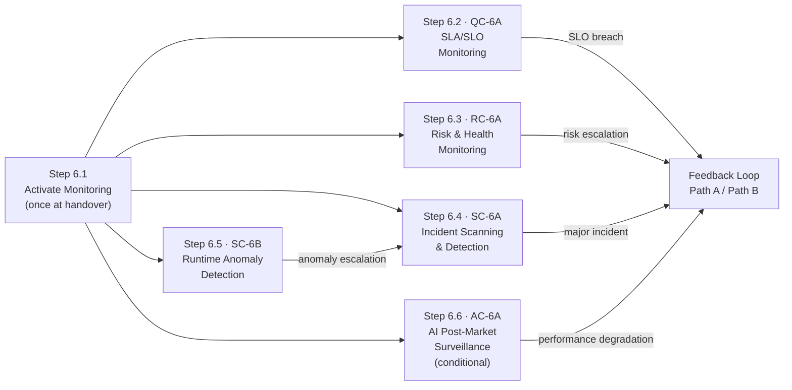

# Stage 6: Observability & Maintenance — Process

## Roles

Canonical role definitions: [../roles.yaml](../roles.yaml)

| Role | Short | Stage 6 responsibilities |
| ---- | ----- | ------------------------- |
| Agent | AGT | Executes continuous monitoring; detects anomalies; classifies incidents; prepares regulatory reports; triggers alerts |
| Operations / SRE | OPS | Activates monitoring at handover; responds to SLO and health alerts; initiates feedback loops for code changes |
| Security Architect | SA | Responds to incident and anomaly escalations; approves DORA Art. 19 classification; investigates security events |
| Risk Officer | RO | Responds to risk escalations from RC-6A; makes risk acceptance decisions; approves feedback loop triggers |
| AI Governance Lead | AGL | Reviews AI post-market surveillance results; files serious AI incident reports per Art. 73 |
| Compliance Officer | CO | Reviews all regulatory incident reports; ensures DORA and AI Act reporting obligations are met |

## Input Artifacts

| Artifact | Provided by | Source |
| -------- | ----------- | ------ |
| Deployment Integrity Record (handover) | Stage 5 SC-5B | [../05-deployment-release/artifacts/outputs/deployment-integrity-record.yaml](../05-deployment-release/artifacts/outputs/deployment-integrity-record.yaml) |

---

## Step Sequence

Step 6.1 activates all monitoring profiles once at Stage 5 handover. Steps 6.2–6.6 then run continuously and in parallel for the operational lifetime of the system.

---

## Step 6.1 — Activate Monitoring

**Delegation:** Fully automated · **Runs once at Stage 5 handover**

| Actor | Action |
| ----- | ------ |
| OPS | Confirm Stage 5 deployment integrity record is present and status is verified |
| AGT | Activate all monitoring profiles: SLO dashboards, health checks, SIEM rules, anomaly baselines |
| AGT | Confirm all monitoring channels are emitting data; alert on any silent channel |
| OPS | Confirm monitoring activation and enter hypercare window |

| | |
| --- | --- |
| **Input** | Deployment integrity record (Stage 5 SC-5B output) |
| **Output** | Monitoring activation confirmed; all Stage 6 controls enter continuous operation |
| **On failure** | If any monitoring channel fails to activate, do not leave Stage 5 hypercare. Resolve and retry |

---

## Step 6.2 — SLA/SLO Monitoring

**Control:** [QC-6A](../../controls/qc/QC-6A.yaml) · **Delegation:** Fully automated · **Continuous**

| Actor | Action |
| ----- | ------ |
| AGT | Continuously measure all defined SLIs against SLOs: availability, latency, error rate, throughput |
| AGT | Compute error budget consumption rate; alert when burn rate exceeds defined thresholds |
| OPS | Respond to burn rate alerts; make decisions on service degradation |
| OPS | Initiate feedback loop if SLO degradation requires a code change |

| | |
| --- | --- |
| **Output** | SLO monitoring record (`artifacts/outputs/slo-monitoring-record.yaml`) — continuously updated |
| **On SLO breach** | Immediate escalation to OPS; may trigger Path B (Quickfix → Stage 3) feedback loop |

---

## Step 6.3 — Risk & Health Monitoring

**Control:** [RC-6A](../../controls/rc/RC-6A.yaml) · **Delegation:** Automated with human escalation · **Continuous**

| Actor | Action |
| ----- | ------ |
| AGT | Monitor configuration drift against approved baseline |
| AGT | Cross-reference SBOM against vulnerability databases; alert on new CVEs affecting dependencies |
| AGT | Monitor application health indicators, capacity trends, certificate expiry, dependency health |
| RO | Respond to risk threshold escalations; make risk acceptance or remediation decisions |
| RO | Initiate feedback loop if risk requires a code or configuration change |

| | |
| --- | --- |
| **Output** | Risk & health monitoring record (`artifacts/outputs/risk-health-monitoring-record.yaml`) — continuously updated |
| **On escalation** | RO reviews; may trigger Path A (Autofix), Path B (Quickfix → Stage 3), or Path B (Feature → Stage 1) |

---

## Step 6.4 — Incident Scanning & Detection

**Control:** [SC-6A](../../controls/sc/SC-6A.yaml) · **Delegation:** Automated with human escalation · **Continuous**

| Actor | Action |
| ----- | ------ |
| AGT | Monitor SIEM continuously using MITRE ATT&CK detection patterns |
| AGT | Detect and classify all security events per DORA Art. 18 taxonomy |
| AGT | For major incidents: start reporting timelines and prepare initial notification |
| SA | Validate incident classification; approve escalation decisions |
| CO | Approve and submit regulatory incident reports per DORA Art. 19 timelines |

**DORA Art. 19 reporting timelines on major incident declaration:**

| Report | Deadline |
| ------ | -------- |
| Initial notification | Within 4 hours |
| Intermediate report | Within 72 hours |
| Final report | Within 1 month of resolution |

| | |
| --- | --- |
| **Output** | Incident detection record (`artifacts/outputs/incident-detection-record.yaml`) — continuously updated |
| **On major incident** | SA validates classification; CO submits regulatory reports per timelines above |

---

## Step 6.5 — Runtime Anomaly Detection

**Control:** [SC-6B](../../controls/sc/SC-6B.yaml) · **Delegation:** Automated with human escalation · **Continuous — feeds into Step 6.4**

| Actor | Action |
| ----- | ------ |
| AGT | Maintain statistical behavioural baselines for all system components |
| AGT | Detect deviations: AI model drift, adversarial inputs, abnormal resource patterns, unexpected call graphs |
| AGT | Escalate anomalies exceeding defined thresholds to SC-6A (Step 6.4) incident process |
| SA | Investigate high-severity anomalies; determine whether anomaly is a security incident or requires code change |

| | |
| --- | --- |
| **Output** | Anomaly detection record (`artifacts/outputs/anomaly-detection-record.yaml`) — continuously updated |
| **On escalation** | Feeds into SC-6A (Step 6.4); may trigger feedback loop if code change is needed |

---

## Step 6.6 — AI Post-Market Surveillance *(conditional)*

**Control:** [AC-6A](../../controls/ac/AC-6A.yaml) · **Delegation:** Agent monitors, AGL reports · **Continuous**

**Condition:** Only applicable when the deployed system includes AI components.

| Actor | Action |
| ----- | ------ |
| AGT | Continuously track AI performance metrics against Stage 4 QC-4B baselines |
| AGT | Execute scheduled bias re-testing at defined intervals |
| AGT | Maintain incident log for any serious AI incidents |
| AGT | Keep AI Act technical documentation current |
| AGL | Review surveillance reports; make decisions on retraining or rollback |
| AGL | File serious AI incident reports to relevant authorities per Art. 73 |

| | |
| --- | --- |
| **Output** | AI post-market surveillance report (`artifacts/outputs/ai-surveillance-report.yaml`) — periodic |
| **On performance degradation** | AGL reviews; may trigger feedback loop for retraining (Stage 1 Feature path) or rollback |

---

## Feedback Loop Summary

| Trigger | Originating control | Path | Re-Entry stage |
| ------- | ------------------- | ---- | -------------- |
| SLO burn rate exceeds threshold | QC-6A | Path B — Quickfix | Stage 3 |
| Low-risk issue matching pre-approved template | RC-6A | Path A — Autofix | Stage 3 |
| Vulnerability in SBOM dependency | RC-6A | Path B — Quickfix | Stage 3 |
| Major security incident requiring code change | SC-6A | Path B — Quickfix or Feature | Stage 3 or Stage 1 |
| Anomaly caused by implementation defect | SC-6B | Path B — Quickfix | Stage 3 |
| AI performance degradation | AC-6A | Path B — Feature | Stage 1 |
| Scope requires new functionality | Any | Path B — Feature | Stage 1 |

Full feedback loop definitions: [../../feedbackloops/feedback-loops.yaml](../../feedbackloops/feedback-loops.yaml)

---

## Output Artifacts

| Artifact | Produced at | Control | Template |
| -------- | ----------- | ------- | -------- |
| SLO Monitoring Record | Step 6.2 (continuous) | QC-6A | [artifacts/outputs/slo-monitoring-record.yaml](artifacts/outputs/slo-monitoring-record.yaml) |
| Risk & Health Monitoring Record | Step 6.3 (continuous) | RC-6A | [artifacts/outputs/risk-health-monitoring-record.yaml](artifacts/outputs/risk-health-monitoring-record.yaml) |
| Incident Detection Record | Step 6.4 (continuous) | SC-6A | [artifacts/outputs/incident-detection-record.yaml](artifacts/outputs/incident-detection-record.yaml) |
| Anomaly Detection Record | Step 6.5 (continuous) | SC-6B | [artifacts/outputs/anomaly-detection-record.yaml](artifacts/outputs/anomaly-detection-record.yaml) |
| AI Post-Market Surveillance Report | Step 6.6 (periodic) | AC-6A | [artifacts/outputs/ai-surveillance-report.yaml](artifacts/outputs/ai-surveillance-report.yaml) |
