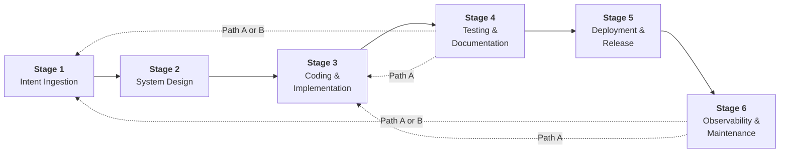

# Stages

> **Auto-generated from [`asdlc.yaml`](../asdlc.yaml)**
>
> Do not edit this file directly. Edit the YAML sources and run:
> ```bash
> python3 scripts/generate-docs.py
> ```

The six lifecycle stages of the A-SDLC. Each stage directory contains the stage definition YAML, auto-generated README, and artifact templates.

---

## Lifecycle Flow

The A-SDLC progresses through six sequential stages. Stages 4 and 6 can trigger feedback loops back into earlier stages for code changes or re-entry.



---

## Stage Overview

| Stage | Name | Description | Controls | Next |
|-------|------|-------------|----------|------|
| [1](01-intent-ingestion/) | Intent Ingestion | High-level business goals are captured, disambiguated, and transformed into structured technical requirements. Establishes the source of truth for all subsequent agentic actions. | 8 | Stage 2 |
| [2](02-system-design/) | System Design | Validated intent is translated into architecture and technical specifications. Threat modelling and stage directive injection occur here before any coding begins. | 8 | Stage 3 |
| [3](03-coding-implementation/) | Coding & Implementation | Code is produced by human developers, AI agents, or both. The most control-dense stage: enforces quality, controls agent permissions, scans for security issues, tracks provenance, and converges into a reviewed PR. | 9 | Stage 4 |
| [4](04-testing-documentation/) | Testing & Documentation | The verification gate. Answers "does it work correctly?" and "is it safe to release?" Culminates in a risk threshold evaluation that opens or blocks the door to deployment. | 9 | Stage 5 |
| [5](05-deployment-release/) | Deployment & Release | Promotion to production. Carries the strongest governance requirements. Ensures everything prior is complete, the deployment is trustworthy, and there is a verified rollback path. | 7 | Stage 6 |
| [6](06-observability-maintenance/) | Observability & Maintenance | The only stage that never ends. Continuous monitoring of operational health, security posture, risk evolution, and AI behaviour. Feeds back into the lifecycle through defined re-entry paths. | 6 | — (continuous) |

---

## Stage Directory Structure

Each stage directory follows the same layout:

```text
NN-stage-name/
├── NN-stage-name.yaml    ← Stage definition: required controls + exit criteria + workflow DAG
├── README.md             ← Auto-generated overview: roles, workflow steps, control details, artifacts
└── artifacts/
    ├── inputs/           ← Input artifact templates (from previous stages)
    └── outputs/          ← Output artifact templates produced by this stage
```

**Stage Definition YAML** (`NN-stage-name.yaml`)

Each stage file conforms to [../schema/stage.schema.json](../schema/stage.schema.json) and contains:

- `number` — stage sequence (1–6)
- `name` and `description` — human-readable identifiers
- `required_controls` — array of control IDs enforced at this stage
- `workflow` — execution DAG with nodes, dependencies, and parallelism rules
- `roles` — stage-specific role definitions and responsibilities
- `exit_criteria` — gates that must pass before advancing
- `artifacts` — input and output artifact templates

This file is the authoritative gate definition. Only controls listed here are enforced. Full control definitions live in [`../controls/[track]/[ID].yaml`](../controls/).

---

## Roles

All roles participating in A-SDLC stages are defined below. Each stage YAML specifies which roles are active and their stage-specific responsibilities.

| Code | Role | Description |
|------|------|-------------|
| REQ | Requester | Submits change requests; the originator of intent. |
| AGT | Agent | Automated AI agent performing processing, drafting, analysis, generation, and logging tasks. |
| PO | Product Owner | Business decision authority; approves specifications and resolves requirement conflicts. |
| RO | Risk Officer | Validates risk classifications; may override agent-proposed tiers with documented justification. |
| SA | Security Architect | Reviews security-flagged items; owns security control escalations and security directive authorship. |
| AGL | AI Governance Lead | Confirms EU AI Act risk tiers for changes involving AI components; owns AC-track controls. |
| LAD | Lead Architect | Owns architectural decisions; formal approval authority for system design at Stage 2. |
| DEV | Developer | Authors and reviews code at Stage 3; accountable for implementation quality and peer review. |
| QA | QA Engineer | Owns test coverage and quality sign-off at Stage 4. |
| REL | Release Manager | Manages the deployment pipeline and CAB coordination at Stage 5. |
| OPS | Operations / SRE | Monitors production health; primary actor triggering feedback loops from Stage 6. |
| CO | Compliance Officer | Reviews audit records and traceability evidence during regulatory audits; no stage-execution role. |

See also: [`roles.yaml`](../asdlc.yaml) (roles are now merged into `asdlc.yaml`).

---

## Control Tracks

The framework organizes controls into five tracks, each addressing a different dimension of quality:

| Track | Name | Description |
|-------|------|-------------|
| **QC** | Quality Controls | Ensure work meets standards |
| **RC** | Risk Controls | Identify and manage what can go wrong |
| **SC** | Security Controls | Protect against threats and vulnerabilities |
| **AC** | AI Controls | Address EU AI Act requirements |
| **GC** | Governance Controls | Maintain the audit trail across everything |

---

## Cross-Cutting Controls

The following controls apply to **every stage** and are not listed per-stage. See [`../controls/README.md`](../controls/README.md) for the full control registry:

- **SC-01** — Core Directive Injection
- **SC-02** — Stage Directive Injection
- **GC-01** — Audit Trail & Compliance Reporting
- **GC-02** — End-to-End Traceability
- **GC-03** — Agent Provenance Registry
- **GC-04** — Compliance Evidence Automation

---

## Feedback Loops

When Stage 4 (Testing & Documentation) or Stage 6 (Observability & Maintenance) detects an issue requiring code changes, the framework provides two feedback loop paths for re-entry:

- **Path A — Quick Fix → Stage 3** — Re-enters at Stage 3
- **Path B — Full Re-entry → Stage 1** — Re-enters at Stage 1

For full feedback loop definitions and decision logic, see [`../feedbackloops/feedback-loops.yaml`](../feedbackloops/feedback-loops.yaml) and [`../feedbackloops/README.md`](../feedbackloops/README.md).

---

**Last Updated:** 2026-03-06 09:10 UTC